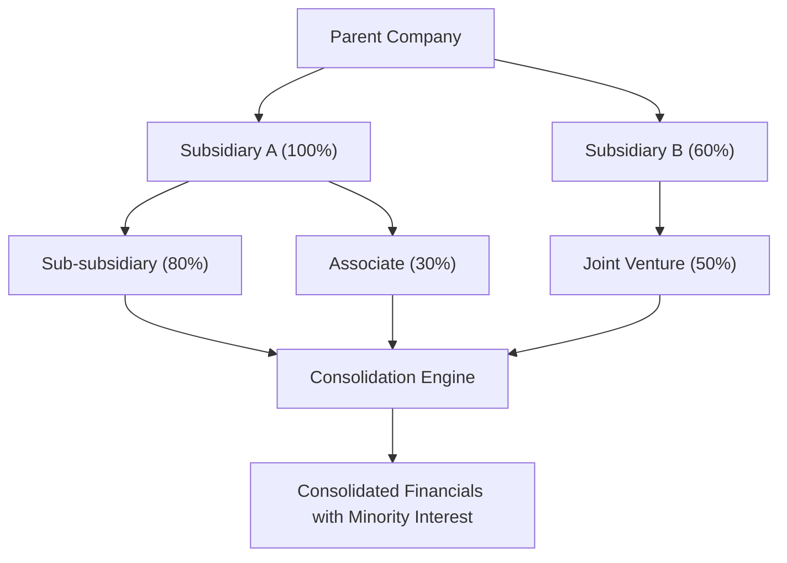

**Category:** Financial Reporting & Analytics
**Difficulty:** Intermediate
**Reading time:** 6 min read

---

Multi-entity consolidation is the process of combining financial statements for complex corporate structures with multiple subsidiary layers, joint ventures, and investments. This advanced consolidation handles scenarios beyond simple parent-subsidiary relationships.

- **Multi-Level Hierarchy** — Parent, subsidiaries, sub-subsidiaries, and other entities
- **Partial Ownership** — Less-than-100% subsidiary ownership requiring minority interest treatment
- **Joint Ventures** — Equity accounting for shared control investments
- **Associates** — Significant influence investments not meeting control threshold
- **Step Acquisitions** — Phased acquisition of subsidiary control over time
- **Push-Down Accounting** — Subsidiary carrying goodwill at subsidiary balance sheet level

Multi-entity consolidation starts by mapping the complete organization structure showing all parent-subsidiary relationships, ownership percentages, and control determination. Each entity's financial statements are gathered and adjusted to consistent accounting policies. Consolidation proceeds hierarchically, starting with the parent consolidating all directly-owned subsidiaries, then consolidating subsidiary-level subsidiaries. For partial ownership (<100%), the non-controlling shareholders' interest is calculated and displayed as minority interest. Joint ventures and associates may be equity-accounted (if less than control) or proportionally consolidated depending on the control structure. All intercompany transactions across the entire hierarchy are eliminated systematically. The result is a consolidated statement showing the parent company's complete economic interest.

- Reporting for multi-layered corporate structures
- Consolidating acquisitions with retained minority owners
- Incorporating joint venture and associate investments
- Managing stepwise acquisition accounting
- Presenting economic results for private equity portfolio companies

| Advantage | Disadvantage |
|-----------|--------------|
| Comprehensive view of complete corporate structure | Significantly complex accounting with high error risk |
| Properly accounts for partial ownership and minority interests | Requires specialized consolidation accounting expertise |
| Accurate intercompany elimination at all levels | Manual process is tedious and error-prone |
| Enables comparison across complex groups | System support needed for efficient consolidation |

- [Financial statement consolidation](financial-statement-consolidation.md)
- [Intercompany eliminations](intercompany-eliminations.md)
- [Joint venture accounting](joint-venture-accounting.md)

---
*Part of the [Financial Reporting & Analytics](financial-reporting-analytics/index.md) category · [Back to Master Index](../../index.md)*
