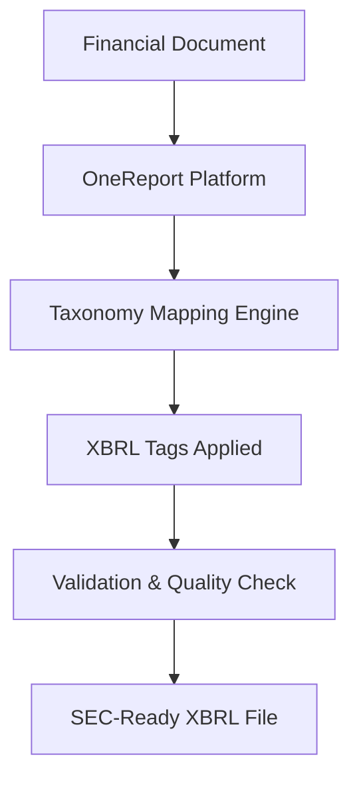

**Category:** Financial Reporting & Analytics
**Difficulty:** Intermediate
**Reading time:** 6 min read

---

OneReport XBRL tagging is a specialized software service that automates the process of applying XBRL (eXtensible Business Reporting Language) tags to financial documents. It enables companies to efficiently prepare SEC filings with accurate, machine-readable financial data that meets regulatory requirements.

- **XBRL Instance Document** — XML-based file containing financial data with semantic tags attached
- **Taxonomy Mapping** — Associating financial line items with standardized XBRL accounting concepts
- **Inline XBRL (iXBRL)** — Human-readable format that embeds machine-readable XBRL data within HTML
- **Validation Engine** — Tool that checks tagged documents for accuracy, completeness, and regulatory compliance
- **Context Definitions** — Metadata describing the period, entity, and scenario for each financial metric

OneReport processes financial documents by first importing data from source systems or manually provided spreadsheets. The platform's mapping engine cross-references each financial line item against the appropriate XBRL taxonomy (US-GAAP, IFRS, or custom). As tags are applied, the system maintains context definitions for each metric, capturing the reporting period, entity hierarchy, and measurement units. A validation engine then checks the tagged document against regulatory rules and best practices, flagging any inconsistencies or missing required elements. The output is a fully compliant XBRL instance document or iXBRL presentation ready for SEC submission.

- Automating 10-K and 10-Q XBRL tagging for public companies
- Improving accuracy and reducing manual tagging errors
- Accelerating financial statement filing timelines
- Supporting foreign private issuer filings with multi-currency compliance
- Enabling audit trail and version control for tagged documents

| Advantage | Disadvantage |
|-----------|--------------|
| Rapid, automated tagging reduces human error | Requires mapping templates for company-specific GL structures |
| Ensures SEC regulatory compliance | Upfront learning curve for taxonomy understanding |
| Generates audit-ready documentation | Integration with ERP/GL systems adds complexity |
| Scalable across multiple entities | Validation may require specialist review |

- [XBRL tagging software](xbrl-tagging-software.md)
- [iXBRL inline reporting](ixbrl-inline-reporting.md)
- [SEC EDGAR filing platforms](sec-edgar-filing-platforms.md)

---
*Part of the [Financial Reporting & Analytics](financial-reporting-analytics/index.md) category · [Back to Master Index](../../index.md)*
