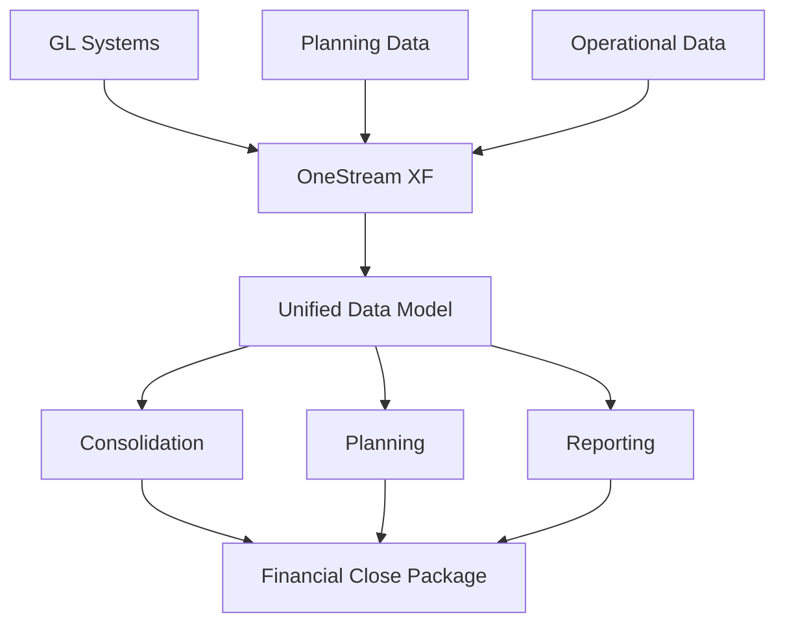

**Category:** Financial Reporting & Analytics
**Difficulty:** Intermediate
**Reading time:** 6 min read

---

OneStream XF is a next-generation financial close and consolidation platform built on modern cloud architecture. It provides integrated financial consolidation, planning, and reporting with high performance and flexibility for enterprise financial operations.

- **Extensible Framework (XF)** — Modular architecture supporting customization
- **Cloud-Native Design** — Built for scalability and modern cloud deployment
- **Real-time Consolidation** — Immediate consolidation of financial data
- **AI-Assisted Close** — Machine learning for exception detection and root cause analysis
- **Unified Data Model** — Single model supporting consolidation, planning, and reporting
- **API-First Architecture** — Programmatic access to all functionality

OneStream XF operates on a unified data model that integrates consolidation, planning, and reporting in a single platform. Financial data is extracted from GL systems and loaded into the platform. The system automatically consolidates across legal entities, cost centers, and currencies, applying elimination rules and intercompany transactions. Actual results are compared to budget and forecast automatically. Planning modules enable future period forecasting and scenario analysis. AI capabilities analyze exceptions and suggest root causes. Reporting generates financial statements and executive dashboards. The cloud-native architecture scales with organizational needs and supports rapid close cycles.

- Enterprise financial close acceleration
- Integrated consolidation and planning
- Complex multi-subsidiary environments
- Real-time financial reporting
- AI-assisted financial operation

| Advantage | Disadvantage |
|-----------|--------------|
| Modern cloud-native architecture | Higher cost vs. legacy solutions |
| Unified platform reducing tool sprawl | Implementation requires transformation |
| Strong consolidation and planning | Learning curve for XF framework |
| AI-assisted close capabilities | Less adoption history vs. established vendors |

- [OneStream unified CPM](onestream-unified-cpm.md)
- [Planful (Host Analytics)](planful-host-analytics.md)
- [Prophix financial planning](prophix-financial-planning.md)

---
*Part of the [Financial Reporting & Analytics](financial-reporting-analytics/index.md) category · [Back to Master Index](../../index.md)*
