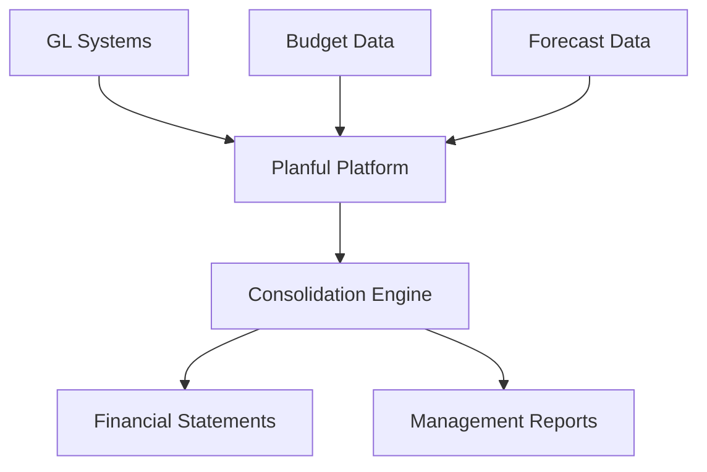

**Category:** Financial Reporting & Analytics
**Difficulty:** Intermediate
**Reading time:** 6 min read

---

Planful is a cloud-based corporate performance management and financial planning solution (formerly Host Analytics). It enables organizations to streamline budgeting, planning, forecasting, and reporting with integrated financial consolidation and reporting capabilities.

- **Financial Consolidation** — Multi-subsidiary and multi-currency consolidation
- **Budget Management** — Centralized budget development and approval workflows
- **Rolling Forecasts** — Continuous forecast updating throughout the year
- **Reporting & Analysis** — Multi-dimensional reporting on financial performance
- **Intercompany Eliminations** — Automated elimination of transactions between entities
- **Currency Translation** — Automated foreign exchange conversion

Planful integrates with multiple GL systems and data sources to pull financial information. The platform provides a unified consolidation engine for multi-subsidiary and multi-currency environments. Budget and forecast modules allow departments to submit planning data, which Planful consolidates hierarchically. The system automatically handles intercompany eliminations and currency translations. Actual results are compared to budget and forecast, with variance analysis identifying significant deviations. Reporting module generates standard financial statements and custom reports from consolidated data. Dashboard visualizations track KPIs and business performance. The platform scales to support enterprise-wide planning and consolidation.

- Enterprise financial consolidation and reporting
- Multi-subsidiary budget and planning management
- Rolling forecast administration and monitoring
- CFO close process acceleration
- Real-time variance analysis and executive reporting

| Advantage | Disadvantage |
|-----------|--------------|
| Strong consolidation capabilities | Complex implementation and customization |
| Scales well for large, complex organizations | Significant training required |
| Integrates planning and reporting | Higher cost for enterprise deployments |
| Good currency and intercompany handling | Long time to value vs. simpler alternatives |

- [Financial planning & analysis (FP&A)](financial-planning-analysis-fpa.md)
- [Adaptive Insights (Workday)](adaptive-insights-workday.md)
- [OneStream XF platform](onestream-xf-platform.md)

---
*Part of the [Financial Reporting & Analytics](financial-reporting-analytics/index.md) category · [Back to Master Index](../../index.md)*
