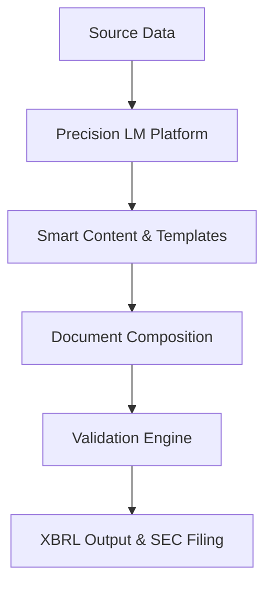

**Category:** Financial Reporting & Analytics
**Difficulty:** Intermediate
**Reading time:** 6 min read

---

Precision LM Disclosure Software provides a specialized disclosure management solution focused on streamlining SEC financial reporting processes. The platform enables teams to compose, manage, and validate financial documents with integrated XBRL capabilities to meet modern regulatory requirements.

- **Disclosure Management System** — Unified platform for document creation and workflow
- **Smart Content Library** — Reusable disclosure blocks and pre-written language
- **Version Control & Change Tracking** — Detailed history of all document modifications
- **XBRL-Ready Output** — Documents can be directly converted to SEC-compliant formats
- **Regulatory Rule Engine** — Built-in validation against current SEC requirements

Precision LM operates as a browser-based disclosure platform where finance and legal teams collaborate on document preparation. The system maintains a content library of common disclosure language and boilerplate sections that can be customized and assembled into complete filings. Users work through guided workflows for different filing types, with the system checking completeness and consistency as documents develop. Version control tracks every change with timestamps and user attribution. Once documents are finalized, built-in conversion capabilities generate XBRL-tagged instances compatible with SEC EDGAR requirements.

- Reducing disclosure preparation time for public companies
- Managing complex multi-entity and multi-currency filings
- Coordinating across distributed finance and legal teams
- Maintaining disclosure consistency year-over-year
- Ensuring compliance with evolving SEC rules and requirements

| Advantage | Disadvantage |
|-----------|--------------|
| Specialized disclosure focus with strong SEC domain expertise | Narrower scope than full finance reporting platforms |
| Content library accelerates document composition | Requires ongoing template maintenance and updates |
| Straightforward cloud deployment with minimal IT overhead | Limited integration with ERP systems without custom work |
| Strong version control and audit trail | May require training investment for effective use |

- [Toppan Merrill ActiveDisclosure](toppan-merrill-activedisclosure.md)
- [iXBRL inline reporting](ixbrl-inline-reporting.md)
- [10-K annual report filing](10-k-annual-report-filing.md)

---
*Part of the [Financial Reporting & Analytics](financial-reporting-analytics/index.md) category · [Back to Master Index](../../index.md)*
