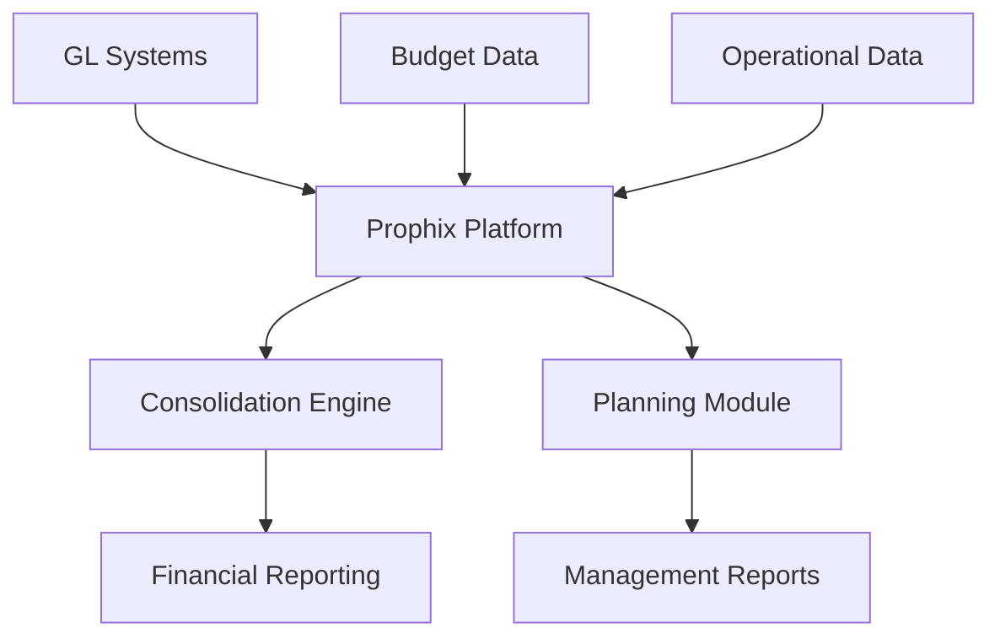

**Category:** Financial Reporting & Analytics
**Difficulty:** Intermediate
**Reading time:** 6 min read

---

Prophix is a financial planning, budgeting, and consolidation platform that serves mid-market and enterprise organizations. It provides integrated CPM capabilities for financial consolidation, planning, and reporting in a single platform.

- **Consolidation Module** — Multi-subsidiary, multi-currency consolidation
- **Planning & Budgeting** — Collaborative budget development and approval
- **Reporting & Analytics** — Financial statement and ad-hoc reporting
- **Intercompany Automation** — Automated elimination of inter-entity transactions
- **Dashboard Visualization** — Executive reporting and KPI monitoring
- **Mobile Planning** — Planning and review workflows on mobile

Prophix serves as a centralized CPM platform connecting to GL systems, budget tools, and operational data. The consolidation engine automatically consolidates multiple subsidiaries and currencies, handling intercompany eliminations and complex hierarchies. Planning modules enable departments to submit budgets and forecasts, which are consolidated through approval workflows. The system performs variance analysis comparing actual to budget and forecast. Reporting capabilities generate standardized financial statements as well as custom reports. Dashboards track business performance against plans and targets. The platform scales to support complex global organizations with numerous entities.

- Financial consolidation for multi-subsidiary organizations
- Budget and planning development and approval
- Rolling forecast administration
- Variance analysis and performance monitoring
- Executive and board reporting

| Advantage | Disadvantage |
|-----------|--------------|
| Good consolidation and planning integration | Implementation complexity and timeline |
| Scales for large, complex organizations | Learning curve for advanced features |
| Reasonable pricing vs. top-tier vendors | May be overkill for simpler scenarios |
| Solid support and training available | Customization may be limited |

- [Planful (Host Analytics)](planful-host-analytics.md)
- [Jedox planning platform](jedox-planning-platform.md)
- [OneStream XF platform](onestream-xf-platform.md)

---
*Part of the [Financial Reporting & Analytics](financial-reporting-analytics/index.md) category · [Back to Master Index](../../index.md)*
