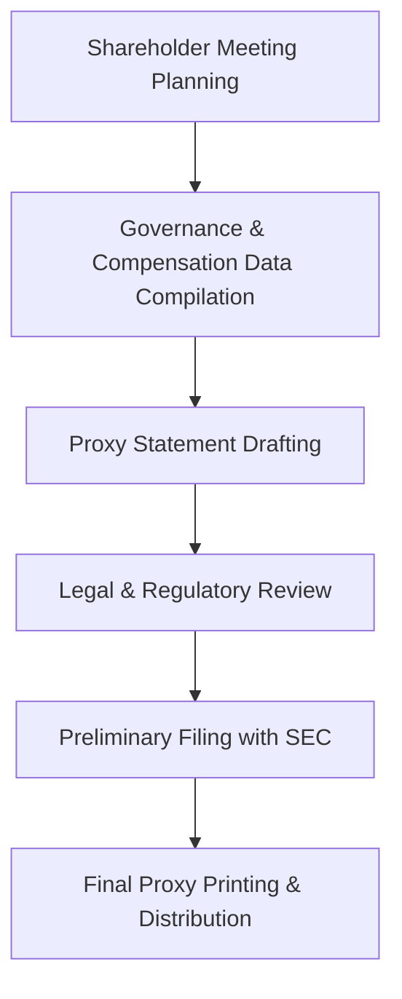

**Category:** Financial Reporting & Analytics
**Difficulty:** Intermediate
**Reading time:** 6 min read

---

The proxy statement (DEF 14A) is a document filed by public companies before shareholder meetings to solicit shareholder votes on matters such as board elections, executive compensation, and corporate governance proposals. It serves as the primary mechanism for shareholder engagement on corporate governance decisions.

- **Proxy Statement (DEF 14A)** — Document soliciting shareholder votes
- **Say-on-Pay Proposal** — Advisory shareholder vote on executive compensation
- **Board Nominees** — Director election proposals and biographical information
- **Corporate Governance** — Governance policies, committee structure, and shareholder proposals
- **Executive Compensation** — CD&A (Compensation Discussion & Analysis)
- **Voting Instructions** — Procedures for shareholders to vote shares

Proxy statement preparation begins months before the annual shareholder meeting as governance and compensation committees define proposals and board nominees. HR and compensation teams prepare the Compensation Discussion & Analysis (CD&A) section detailing executive pay philosophy, structure, and individual compensation. Legal counsel ensures compliance with SEC rules on proxy disclosures and corporate governance requirements. The preliminary proxy (PREM14A) is filed with the SEC for review. After SEC feedback, the final proxy (DEF 14A) is filed and printed. The proxy is mailed or electronically delivered to all shareholders, along with voting instructions. Shareholders vote by proxy card, phone, or online, and results are reported at the annual meeting.

- Conducting annual shareholder meetings and director elections
- Seeking shareholder approval on compensation governance and policies
- Disclosing corporate governance practices and board structure
- Addressing shareholder proposals on social and environmental topics
- Maintaining shareholder engagement and governance transparency

| Advantage | Disadvantage |
|-----------|--------------|
| Ensures shareholder voting and governance participation | Significant preparation effort and cost |
| Provides transparency on governance and compensation | Detailed executive pay disclosure may attract criticism |
| Enables shareholder feedback through proposals and voting | Shareholder activism can create governance pressure |
| Supports investor confidence in governance structure | Regulatory compliance requirements are complex |

- [10-K annual report filing](10-k-annual-report-filing.md)
- [Executive compensation disclosure](executive-compensation-disclosure.md)
- [SEC EDGAR filing platforms](sec-edgar-filing-platforms.md)

---
*Part of the [Financial Reporting & Analytics](financial-reporting-analytics/index.md) category · [Back to Master Index](../../index.md)*
