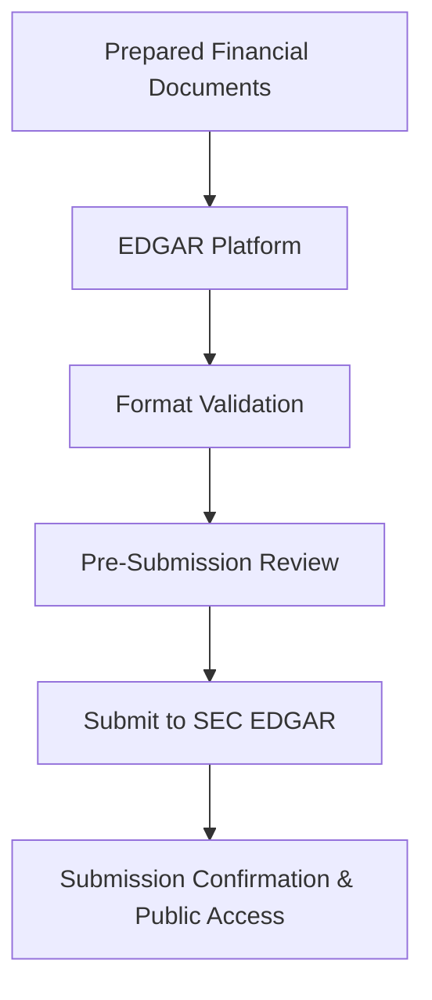

**Category:** Financial Reporting & Analytics
**Difficulty:** Intermediate
**Reading time:** 6 min read

---

SEC EDGAR filing platforms are systems that enable companies to submit regulatory financial documents directly to the SEC's Electronic Data Gathering system. These platforms streamline the submission process, validate documents against SEC requirements, and maintain submission records for compliance tracking.

- **EDGAR System** — SEC's official electronic filing system for public company disclosures
- **CIK Number** — Central Index Key that uniquely identifies each filer
- **Form Types** — Different filing templates (10-K, 10-Q, 8-K, DEF 14A, etc.)
- **Submission Validation** — Pre-submission checks for SEC format and content requirements
- **Filing Workflows** — Automated submission and confirmation tracking

SEC EDGAR filing platforms accept formatted financial documents (typically XBRL, HTML, and text files) and validate them against SEC specifications before submission. The platform verifies that the filing contains all required sections, uses correct form types and CIK identification, includes proper signatures (digital or scanned), and adheres to file naming conventions. Upon validation, the platform submits the documents to the SEC's EDGAR system via secure connection. The SEC system processes the submission, performs additional validation, assigns an Accession Number, and makes the filing publicly available on EDGAR. Filing platforms maintain records of all submissions and confirmations for audit trails and compliance documentation.

- Automating SEC EDGAR submission process for public companies
- Managing multiple concurrent filings (10-K, 10-Q, 8-K, proxies)
- Reducing submission errors and rejection rates
- Maintaining compliance with SEC deadline requirements
- Providing submission history and tracking capabilities

| Advantage | Disadvantage |
|-----------|--------------|
| Streamlines SEC submission process reducing manual effort | Requires proper document formatting upstream |
| Real-time validation prevents rejected submissions | Learning curve for different form types and requirements |
| Complete audit trail of all submissions | SEC deadline changes may require platform updates |
| Reduces errors in submission metadata | Integration with document prep systems needed |

- [iXBRL inline reporting](ixbrl-inline-reporting.md)
- [10-K annual report filing](10-k-annual-report-filing.md)
- [XBRL tagging software](xbrl-tagging-software.md)

---
*Part of the [Financial Reporting & Analytics](financial-reporting-analytics/index.md) category · [Back to Master Index](../../index.md)*
