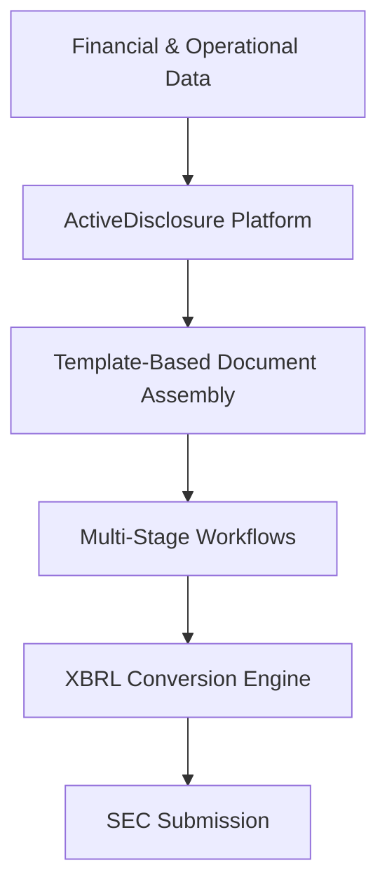

**Category:** Financial Reporting & Analytics
**Difficulty:** Intermediate
**Reading time:** 6 min read

---

Toppan Merrill ActiveDisclosure is a cloud-based disclosure management platform that helps companies automate financial and non-financial reporting for SEC compliance. The platform enables organizations to manage complex disclosure documents, control version workflows, and ensure accurate regulatory submissions at scale.

- **Disclosure Hub** — Central repository for all financial and non-financial disclosures
- **Smart Templates** — Pre-configured document structures mapped to SEC requirements
- **Workflow Automation** — Multi-stage review and approval processes with role-based controls
- **XBRL Integration** — Seamless conversion to machine-readable financial formats
- **Audit Trail** — Complete record of document changes, approvals, and submissions

ActiveDisclosure centralizes financial and non-financial disclosure management through a cloud platform that organizations access via web interface. Users select templates corresponding to their filing type (10-K, 10-Q, proxy, etc.) and populate sections with data from source systems or manual input. The platform routes documents through configurable review workflows where stakeholders at different levels approve content. Built-in rules validation checks compliance with SEC requirements and internal policies. Upon final approval, the system generates XBRL-tagged versions alongside human-readable formats, all ready for EDGAR submission or investor distribution.

- Coordinating disclosure across finance, legal, and investor relations teams
- Managing multi-subsidiary and multi-currency disclosures
- Automating XBRL tagging within a disclosure management workflow
- Creating repeatable processes for quarterly and annual filings
- Reducing disclosure cycle time and improving document accuracy

| Advantage | Disadvantage |
|-----------|--------------|
| Reduces friction across multiple stakeholder teams | Requires upfront configuration and template customization |
| Strong XBRL compliance capabilities built-in | Cloud-only model may have limited offline capabilities |
| Scalable for large, complex organizations | Higher costs for enterprise deployments |
| Maintains complete audit trail of changes | User adoption learning curve in large organizations |

- [Donnelley Financial Solutions (DFIN)](donnelley-financial-solutions-dfin.md)
- [XBRL tagging software](xbrl-tagging-software.md)
- [10-K annual report filing](10-k-annual-report-filing.md)

---
*Part of the [Financial Reporting & Analytics](financial-reporting-analytics/index.md) category · [Back to Master Index](../../index.md)*
