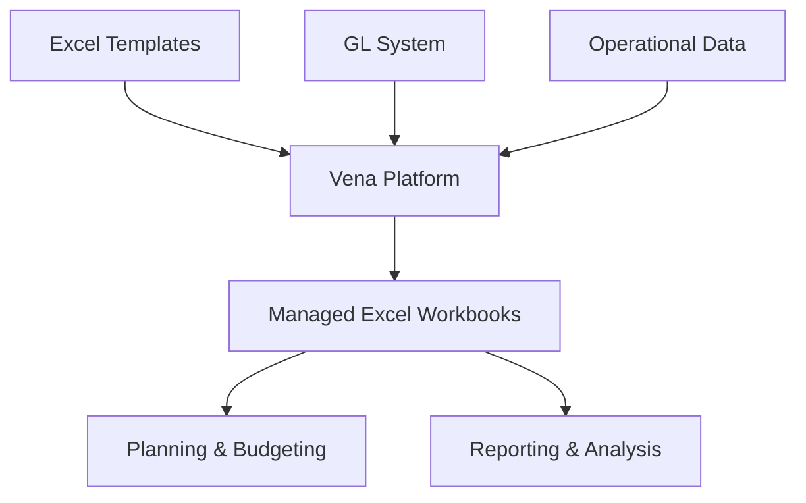

**Category:** Financial Reporting & Analytics
**Difficulty:** Intermediate
**Reading time:** 6 min read

---

Vena Solutions is an Excel-based financial planning and analysis platform that provides budgeting, forecasting, and reporting capabilities while maintaining the familiar Excel interface that finance teams prefer. The platform bridges Excel's flexibility with enterprise planning controls and governance.

- **Excel Interface** — Native Excel experience with planning features embedded
- **Enterprise Governance** — Approval workflows and audit trails within Excel
- **Data Integration** — Connection to GL systems and operational data sources
- **Scalability** — Supporting large models and multiple concurrent users
- **Mobile Access** — Planning tasks on mobile devices
- **Consolidation** — Multi-level company and cost center consolidation

Vena Solutions operates as an Excel-based interface layered on top of a cloud platform. Finance teams work in familiar Excel spreadsheets that Vena enhances with planning capabilities, approval workflows, and data connections. The platform connects to GL systems to import actuals data and link budget and forecast models to real transactions. Users develop budget and forecast models in Excel while Vena manages version control, collaboration, and audit trails behind the scenes. Once models are completed and approved, Vena consolidates results and produces financial reports. The platform provides reporting and analytics that enable exploration of plan data outside of Excel. Mobile apps enable planning input and approval on mobile devices.

- Budget development for finance teams preferring Excel
- Rolling forecast management with Excel models
- Departmental budget input and consolidation
- Sales and operational planning linked to financial impact
- Reducing IT dependencies while maintaining governance

| Advantage | Disadvantage |
|-----------|--------------|
| Excel familiarity reduces training burden | Limited to organizations wanting Excel-centric approach |
| Good governance within Excel environment | May not scale to most complex scenarios |
| Strong collaborative planning capabilities | Less powerful analytics than dedicated BI tools |
| Quick implementation for Excel users | Brand recognition lower than major vendors |

- [Financial planning & analysis (FP&A)](financial-planning-analysis-fpa.md)
- [Planful (Host Analytics)](planful-host-analytics.md)
- [OneStream XF platform](onestream-xf-platform.md)

---
*Part of the [Financial Reporting & Analytics](financial-reporting-analytics/index.md) category · [Back to Master Index](../../index.md)*
