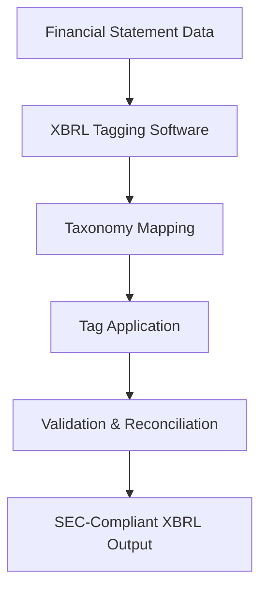

**Category:** Financial Reporting & Analytics
**Difficulty:** Intermediate
**Reading time:** 6 min read

---

XBRL tagging software automates the application of semantic tags to financial statement data, transforming human-readable financial documents into machine-readable formats compliant with SEC requirements. This category of tools is essential for modernizing financial reporting and enabling better data analysis by regulators and investors.

- **Semantic Tagging** — Attaching standardized meaning to financial data elements
- **Taxonomy Framework** — Standardized chart of accounts and line item definitions
- **Validation Rules** — Automated checks for data consistency and regulatory compliance
- **Format Conversion** — Transformation between XBRL, iXBRL, and presentation formats
- **Reconciliation Engine** — Ensuring tagged data matches source financial statements

XBRL tagging software begins by accepting financial statement data in various formats (PDF, Excel, HTML). The software maps each line item and supporting detail to the appropriate XBRL taxonomy elements, typically US-GAAP for US companies or IFRS for international filings. The system applies context information (reporting period, entity, scenario) to each metric, creating a complete instance document. Built-in validation engines verify that all required elements are present, calculations reconcile properly, and values conform to regulatory rules. The output is a set of XBRL files that can be directly submitted to SEC EDGAR or enhanced with HTML formatting for iXBRL presentation.

- Automating XBRL instance document generation for SEC filings
- Supporting multiple filing types (10-K, 10-Q, 8-K, proxy statements)
- Handling complex consolidations and intercompany eliminations
- Managing foreign registrant filings with currency conversions
- Integrating with broader financial reporting workflows

| Advantage | Disadvantage |
|-----------|--------------|
| Reduces manual tagging errors and accelerates timeline | Requires specialized knowledge of XBRL and taxonomies |
| Provides consistent, repeatable tagging process | Validation may require specialist review for complex items |
| Generates complete audit trail of tagging decisions | Upfront cost and learning curve for implementation |
| Scalable across multiple filings and entities | Integration with GL systems adds complexity |

- [iXBRL inline reporting](ixbrl-inline-reporting.md)
- [SEC EDGAR filing platforms](sec-edgar-filing-platforms.md)
- [OneReport XBRL tagging](onereport-xbrl-tagging.md)

---
*Part of the [Financial Reporting & Analytics](financial-reporting-analytics/index.md) category · [Back to Master Index](../../index.md)*
