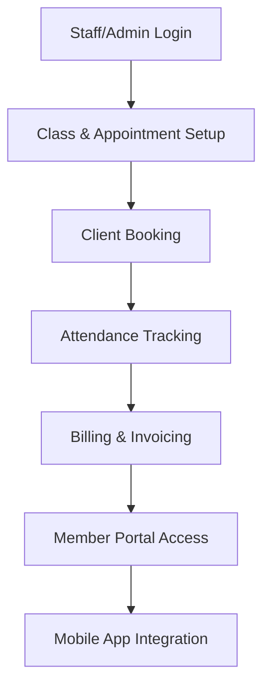

**Category:** Fitness & Wellness Platforms
**Difficulty:** Intermediate
**Reading time:** 6 min read

---

Mindbody is a comprehensive business management platform for fitness, wellness, and beauty businesses. It provides scheduling, billing, client management, and integrated mobile apps, enabling seamless operations and member engagement.

- **Scheduling System** — Class and appointment booking with calendar integration
- **Membership Management** — Flexible membership types, pricing, and billing
- **Point of Sale** — Retail product sales and recurring billing
- **Client Portal** — Members book classes, track progress, and manage accounts
- **Analytics Dashboard** — Business metrics, revenue tracking, and client insights

Studio administrators configure class schedules, instructor availability, and pricing. The platform provides an online booking interface for clients to schedule classes and appointments. Automated reminders reduce no-shows. Check-in at the studio tracks attendance and verifies membership status. The billing system automatically charges membership fees and retail purchases, generating invoices and payment confirmations. The member portal allows clients to manage bookings, track progress, and update preferences. The mobile app extends access for on-the-go booking and class discovery, with push notifications for class reminders and promotions.

- Fitness studios and gym management
- Yoga and pilates studio scheduling
- Personal training client booking
- Spa and beauty salon operations
- Wellness center class management
- Corporate wellness program hosting

| Advantage | Disadvantage |
|-----------|--------------|
| All-in-one platform reduces tool switching | Learning curve for full feature set |
| Excellent member portal and mobile experience | Pricing can be expensive for small studios |
| Strong automation reduces administrative burden | Limited customization options |
| Good analytics and business insights | Integrations with third-party systems limited |
| Established ecosystem and large user base | Support response times vary |

- [Mindbody Booking System](mindbody-booking-system.md)
- [Mindbody Payment Processing](mindbody-payment-processing.md)
- [Gym Member Portal Hosting](gym-member-portal-hosting.md)

---
*Part of the [Fitness & Wellness Platforms](index.md) category · [Back to Master Index](../../index.md)*
