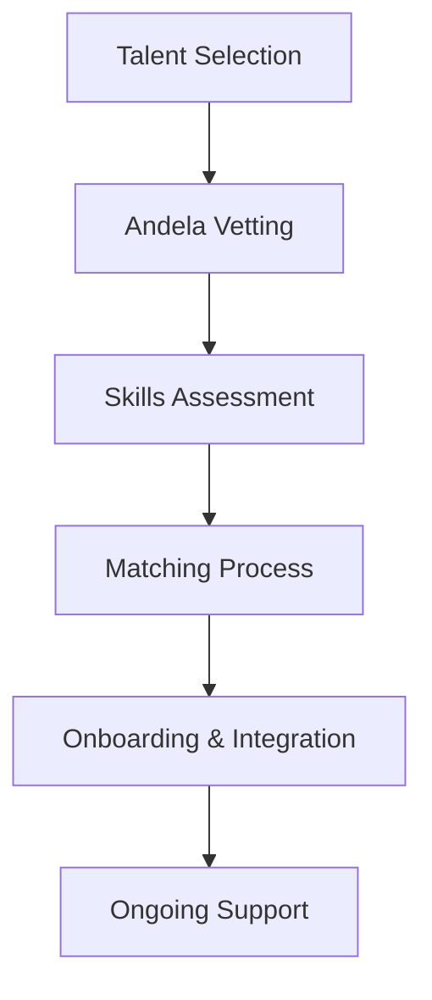

**Category:** Freelance & Gig Platforms
**Difficulty:** Intermediate
**Reading time:** 6 min read

---

Andela is a developer talent platform connecting companies with African-based software engineers for full-time remote positions and project-based work. The platform focuses on building, training, and vetting developer talent from Africa while helping enterprises access skilled engineers at competitive rates, functioning both as a talent development platform and a staffing marketplace.

- **Africa-Based Talent** — focuses on developers from African continent
- **Talent Development** — invests in training and skill development
- **Quality Vetting** — rigorous technical screening and assessment
- **Remote Work Model** — primarily full-time remote positions
- **Full-Time Placement** — emphasis on permanent or long-term engagement

Andela recruits developers from Africa and puts them through rigorous technical screening, assessment, and training programs. Companies looking to hire engineers access Andela's vetted talent pool, providing job descriptions and requirements. Andela matches qualified developers to opportunities based on skill fit and business requirements. Once matched, developers are typically placed for full-time remote work with companies, often as contractual or full-time employees. Andela provides ongoing support, training, and career development for both developers and hiring companies, creating long-term professional relationships rather than transactional engagements.

- Building remote development teams
- Scaling engineering capacity
- Full-time software engineer hiring
- Long-term technical talent needs
- Teams for specific technology stacks
- Reducing hiring and onboarding overhead
- Cost-effective senior engineering talent
- Diversifying development teams

| Advantage | Disadvantage |
|-----------|--------------|
| Cost-effective talent acquisition | Longer placement timelines |
| Rigorous technical vetting | Requires long-term commitment |
| Ongoing developer support included | Timezone coordination needed |
| Quality development training | Less flexibility than project work |
| Full-time integration focus | Limited short-term project options |

- [X-Team Remote Developers](x-team-remote-developers.md)
- [Turing AI-vetted Developers](turing-ai-vetted-developers.md)
- [Gigster Software Development](gigster-software-development.md)

---
*Part of the [Freelance & Gig Platforms](index.md) category · [Back to Master Index](../../index.md)*
