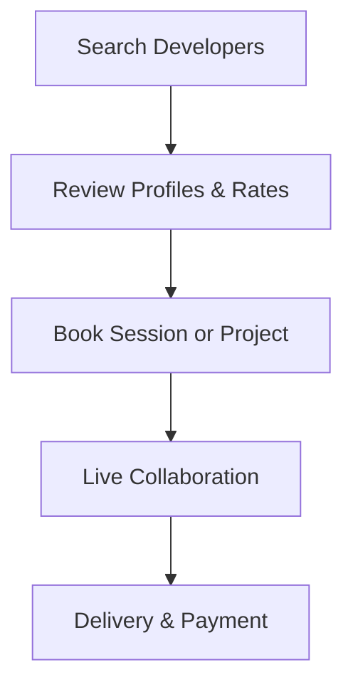

**Category:** Freelance & Gig Platforms
**Difficulty:** Intermediate
**Reading time:** 6 min read

---

Arc (formerly Codementor) is a developer freelance marketplace connecting software engineers with companies for both hourly mentoring/consulting and project-based work. The platform enables real-time code collaboration, pair programming sessions, and technical consulting while also supporting traditional project matching for full-stack development work at various scales.

- **Real-Time Collaboration** — live code editing, screen sharing, and pair programming
- **Hourly and Project Work** — flexible engagement from calls to long-term projects
- **Developer Expertise Verification** — skill assessment and project portfolio validation
- **Global Talent Access** — developers from worldwide network with diverse specializations
- **Transparent Communication** — direct messaging and work-in-progress tracking

Companies search Arc's marketplace of developers by skills, experience, hourly rates, and availability. Developers maintain detailed profiles showcasing expertise, completed projects, and client reviews. For quick needs, companies can book one-off mentoring or consulting sessions for immediate live collaboration. For larger projects, companies post work and developers submit proposals. The platform provides real-time collaboration tools including code editors, screen sharing, and communication. Payment is processed through Arc with protections for both parties, and work quality is tracked through client reviews and ratings.

- Code review and debugging assistance
- Pair programming and mentoring
- Technical architecture consultation
- Full-stack development projects
- Specialized technology expertise
- Quick technical problem-solving
- Knowledge transfer and training
- Interview preparation coaching

| Advantage | Disadvantage |
|-----------|--------------|
| Real-time collaboration tools | Quality varies by individual developer |
| Flexible hourly or project engagement | Requires synchronous communication |
| Global developer access | Timezone coordination needed |
| Quick booking for urgent needs | Less platform-level project management |
| Direct developer relationships | Communication overhead per engagement |

- [CodementorX Enterprise Devs](codementorx-enterprise-devs.md)
- [Braintrust Freelance Network](braintrust-freelance-network.md)
- [Gun.io Developer Marketplace](gunio-developer-marketplace.md)

---
*Part of the [Freelance & Gig Platforms](index.md) category · [Back to Master Index](../../index.md)*
