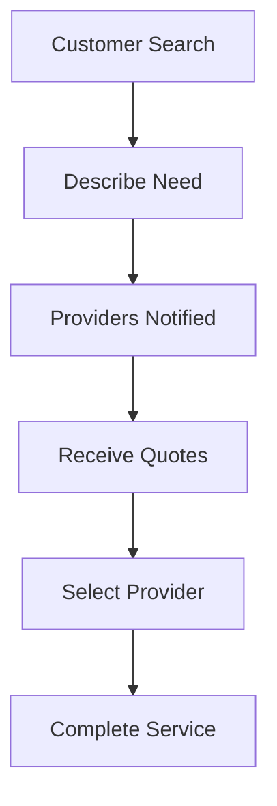

**Category:** Freelance & Gig Platforms
**Difficulty:** Intermediate
**Reading time:** 6 min read

---

Bark.com is a service marketplace and lead generation platform connecting customers with local service providers across home services, tutoring, entertainment, events, and professional services. The platform enables customer discovery of vetted professionals while generating qualified leads for service providers who pay for customer inquiries in their service category and location.

- **Two-Sided Marketplace** — customers find services, providers buy leads
- **Lead Monetization** — service providers pay for qualified customer inquiries
- **Service Diversity** — hundreds of categories from plumbing to event planning
- **Location Targeting** — matches local providers with nearby customers
- **Review Transparency** — provider ratings and customer reviews featured prominently

Customers post specific service requests with location and details. Bark sends these inquiries to relevant service providers in the area who have paid for lead access. Providers respond with quotes and availability. Customers compare options and select a provider. The platform facilitates discovery but typically doesn't process payments directly, allowing providers and customers to arrange payment independently. Bark generates revenue from service providers who pay for lead access based on geographic location, service category, and inquiry frequency.

- Finding local contractors and tradespeople
- Home improvement and repair services
- Tutoring and educational services
- Event planning and entertainment
- Cleaning and housekeeping services
- Pet care and services
- Photography and media services
- Consulting and professional services

| Advantage | Disadvantage |
|-----------|--------------|
| Broad service category coverage | Lead quality varies by providers |
| Easy customer access to quotes | Providers may receive many poor-fit inquiries |
| Payment flexibility between parties | Less platform-enforced quality control |
| Large provider network | Customer support limited to platform |
| Cost-effective discovery for customers | Not integrated payment processing |

- [Thumbtack Professional Services](thumbtack-professional-services.md)
- [TaskRabbit Local Services](taskrabbit-local-services.md)
- [Catalant Consulting Marketplace](catalant-consulting-marketplace.md)

---
*Part of the [Freelance & Gig Platforms](index.md) category · [Back to Master Index](../../index.md)*
