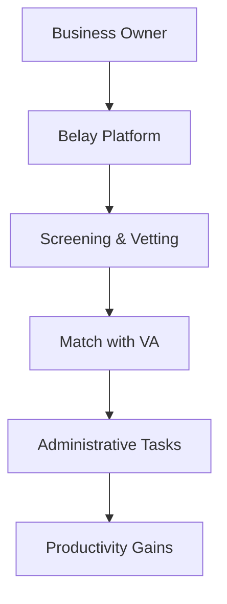

**Category:** Freelance & Gig Platforms
**Difficulty:** Intermediate
**Reading time:** 6 min read

---

Belay is a virtual assistant service that provides remote administrative professionals to handle tasks like email management, scheduling, bookkeeping, and customer service. The platform connects business owners and entrepreneurs with vetted U.S.-based virtual assistants who work as independent contractors, enabling businesses to outsource non-core work while maintaining quality and reliability.

- **Virtual Assistant Model** — remote professionals providing administrative support across various functions
- **Independent Contractor Network** — pre-vetted assistants available for flexible engagement
- **Task-Based Work** — specific administrative functions like email, scheduling, and data entry
- **Managed Service** — Belay handles recruitment, training, and quality assurance
- **Cost Flexibility** — pricing based on hours worked rather than full-time salary

Belay operates as a managed marketplace where businesses submit requests for administrative support. The platform vets and screens candidates to ensure quality before matching them with clients. Virtual assistants handle tasks like inbox management, appointment scheduling, expense tracking, customer communications, and data entry. Clients maintain direct communication with their assigned assistant while Belay handles the backend operations, including onboarding, performance monitoring, and support. The service model is flexible, allowing clients to scale hours up or down based on business needs without long-term commitments.

- Small business owners needing administrative support
- Entrepreneurs wanting to focus on core business activities
- Professionals managing high email volume
- Companies with seasonal administrative needs
- Businesses handling customer service inquiries
- Accounting and bookkeeping support needs
- Content management and social media scheduling

| Advantage | Disadvantage |
|-----------|--------------|
| U.S.-based vetted professionals | Higher cost than offshore alternatives |
| Direct communication with assigned VA | May require onboarding time |
| Flexible scaling of hours | Limited deep technical expertise |
| Quality control and support included | Potential turnover of assistants |
| Reduces owner workload | Requires clear documentation of tasks |

- [Fancy Hands Task Assistance](fancy-hands-task-assistance.md)
- [Time Etc Virtual Assistants](time-etc-virtual-assistants.md)
- [TaskRabbit Local Services](taskrabbit-local-services.md)

---
*Part of the [Freelance & Gig Platforms](index.md) category · [Back to Master Index](../../index.md)*
