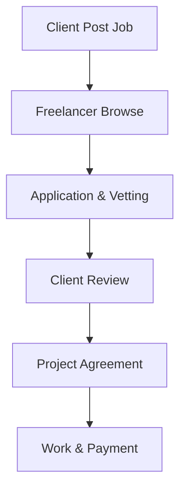

**Category:** Freelance & Gig Platforms
**Difficulty:** Intermediate
**Reading time:** 6 min read

---

Braintrust is a freelance marketplace that connects skilled professionals (designers, developers, marketers, project managers) with companies seeking specialized talent. Operating as a decentralized network with a focus on direct relationships and fair compensation, Braintrust allows freelancers to work directly with clients while the platform handles matching, vetting, and administrative logistics with transparent pricing models.

- **Freelancer-Centric Model** — focuses on fair pricing and direct client relationships
- **Skills-Based Matching** — connects specific talent needs with qualified professionals
- **Portfolio Verification** — work samples and reference checks ensure quality
- **Transparent Pricing** — clear visibility on rates and project costs
- **Project-Based and Ongoing** — supports both one-off projects and retainer arrangements

Companies post projects or ongoing work needs on Braintrust with descriptions, budgets, and timelines. Vetted freelancers review available opportunities and apply with portfolios and relevant experience. Clients review applications, portfolios, and references before selecting professionals. The platform facilitates contract formation, communication, milestone tracking, and payment processing. Braintrust emphasizes direct relationships between clients and freelancers, removing unnecessary intermediaries while providing infrastructure for project management, escrow protection, and dispute resolution.

- Software development projects
- Web and UX design services
- Marketing and content creation
- Project management support
- Business analysis and strategy
- Full-stack application development
- Mobile app development
- Ongoing technical support and mentorship

| Advantage | Disadvantage |
|-----------|--------------|
| Freelancer-favorable terms and transparency | Smaller talent pool than larger platforms |
| Direct client-freelancer relationships | May require more client side screening |
| Portfolio and experience verification | Less platform brand recognition |
| Flexible engagement models | Fewer built-in quality guarantees |
| Fair compensation focus | Administrative burden on clients |

- [Catalant Consulting Marketplace](catalant-consulting-marketplace.md)
- [Gun.io Developer Marketplace](gunio-developer-marketplace.md)
- [X-Team Remote Developers](x-team-remote-developers.md)

---
*Part of the [Freelance & Gig Platforms](index.md) category · [Back to Master Index](../../index.md)*
