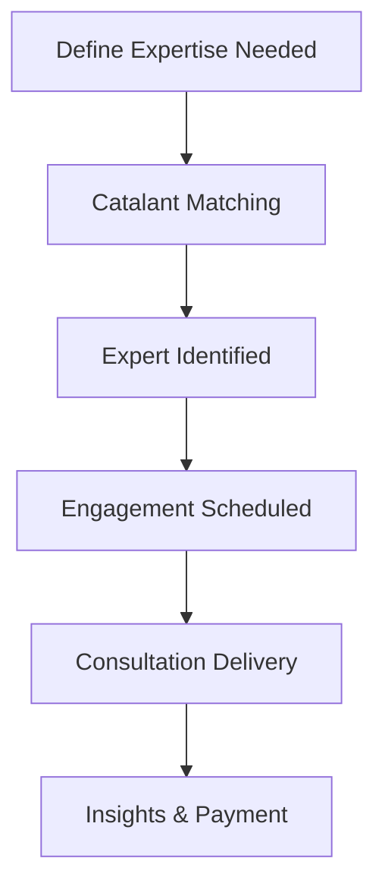

**Category:** Freelance & Gig Platforms
**Difficulty:** Intermediate
**Reading time:** 6 min read

---

Catalant (formerly GLG) is an enterprise consulting marketplace connecting businesses with independent experts and consultants across industries, functions, and specialties. The platform facilitates short-term expertise access, research calls, and project-based consulting engagements, serving as a bridge between companies needing specialized knowledge and vetted professionals available for flexible engagements.

- **Expert Network Model** — curated database of vetted industry and subject matter experts
- **Flexible Engagement** — short calls, project work, or ongoing advisory relationships
- **Industry Specialization** — deep expertise across sectors, companies, and functions
- **Confidentiality Focus** — professional quality control and confidentiality agreements
- **Enterprise Clientele** — primarily serves large corporations and institutional buyers

Catalant maintains a network of pre-vetted experts across industries, geographies, and specializations. Enterprise clients submit requests for specific expertise with details about their information need or project scope. The platform's matching team identifies qualified experts from the network and coordinates scheduling. Engagements can range from brief consultation calls (30 minutes to 2 hours) for research and perspectives to longer-term project work. The platform handles vetting, confidentiality agreements, scheduling, and payment, enabling businesses to access specialized expertise without long-term hiring commitments.

- Market research and competitive intelligence
- Industry expert perspectives for due diligence
- Regulatory and compliance expertise
- Product strategy and customer insight calls
- Technical due diligence for M&A
- Industry trend analysis and forecasting
- Go-to-market strategy consulting
- Operational improvement projects

| Advantage | Disadvantage |
|-----------|--------------|
| Access to deep subject matter expertise | Premium pricing for expert time |
| Enterprise-grade vetting and compliance | Longer matching times than gig platforms |
| Confidentiality and legal protections | May require detailed scope documentation |
| Flexible engagement lengths | Limited to expert availability |
| Curated expert network | Higher barrier to entry for smaller clients |

- [Braintrust Freelance Network](braintrust-freelance-network.md)
- [Bark.com Lead Generation](barkcom-lead-generation.md)
- [Andela Developer Platform](andela-developer-platform.md)

---
*Part of the [Freelance & Gig Platforms](index.md) category · [Back to Master Index](../../index.md)*
