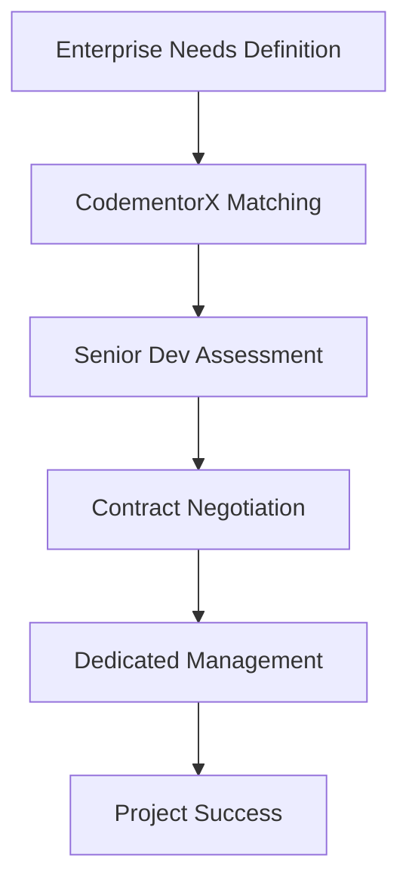

**Category:** Freelance & Gig Platforms
**Difficulty:** Intermediate
**Reading time:** 6 min read

---

CodementorX is an enterprise-focused developer platform providing vetted, senior software engineers for long-term remote positions and specialized projects. Operating as the premium, B2B arm of the Codementor network, CodementorX emphasizes rigorous vetting, higher-quality talent matching, and professional project management suitable for enterprise requirements and complex development needs.

- **Enterprise-Grade Vetting** — more rigorous screening than standard marketplaces
- **Senior Developer Focus** — emphasis on experienced professionals with proven expertise
- **Long-Term Engagement** — primarily full-time or extended project arrangements
- **Professional Account Management** — dedicated support for enterprise clients
- **Quality Guarantees** — service level agreements and performance standards

Enterprise clients describe complex development needs, team composition requirements, and technical specifications. CodementorX performs rigorous vetting and matching from their network of senior developers. The platform assigns an account manager to coordinate communication, manage project scope, and ensure client satisfaction. Developers are pre-vetted for specific technologies, industry experience, and professional maturity. Service agreements outline deliverables, timelines, and quality standards. CodementorX provides ongoing support, escalation management, and developer replacement guarantees if performance doesn't meet expectations.

- Complex enterprise software development
- Multi-developer project teams
- Long-term remote engineering augmentation
- Technical leadership and architecture roles
- Critical system development and maintenance
- Digital transformation initiatives
- High-stakes product development
- Enterprise technology stack specialization

| Advantage | Disadvantage |
|-----------|--------------|
| Enterprise-quality vetting | Premium pricing vs marketplaces |
| Dedicated account management | Less flexibility in developer changes |
| Service level guarantees | Longer engagement commitments |
| Senior developer access | May be overkill for small projects |
| Professional communication channels | Higher minimum engagement sizes |

- [Arc (Formerly Codementor)](arc-formerly-codementor.md)
- [Gigster Software Development](gigster-software-development.md)
- [Gun.io Developer Marketplace](gunio-developer-marketplace.md)

---
*Part of the [Freelance & Gig Platforms](index.md) category · [Back to Master Index](../../index.md)*
