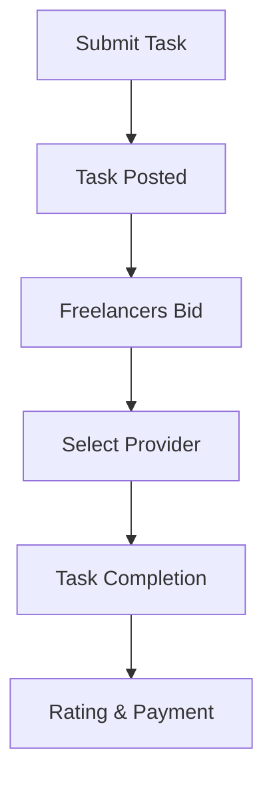

**Category:** Freelance & Gig Platforms
**Difficulty:** Intermediate
**Reading time:** 6 min read

---

Fancy Hands is a gig-based task assistance platform that connects users with freelance professionals to handle quick administrative, research, and personal tasks remotely. The platform focuses on flexible, one-off tasks completed by vetted contractors, making it ideal for businesses and individuals needing sporadic help without long-term commitments.

- **Task-Marketplace Model** — submit tasks and receive bids from qualified freelancers
- **Gig-Based Engagement** — payment per task completion rather than hourly retainers
- **Quality Vetting** — contractors are screened and rated by community
- **Speed Focus** — designed for quick turnaround tasks, often 24-48 hour completion
- **Diverse Task Support** — email, research, scheduling, data entry, personal errands

Users post detailed task descriptions on the Fancy Hands platform specifying what needs to be accomplished, deadlines, and budgets. Freelancers review available tasks and submit bids, allowing users to select from qualified contractors based on pricing and past performance. Once assigned, the contractor completes the work and submits deliverables. Users can request revisions and rate the contractor upon completion. The platform handles payment processing and dispute resolution, creating a marketplace dynamic that encourages competitive pricing and quality work.

- Quick administrative tasks and follow-ups
- Research and data collection projects
- Email and inbox management
- Personal errand handling
- Meeting scheduling and calendar management
- Web research and competitor analysis
- Customer service follow-ups
- Content curation and summary writing

| Advantage | Disadvantage |
|-----------|--------------|
| Pay-per-task flexibility | Quality varies by contractor |
| No long-term commitment | Requires detailed task documentation |
| Competitive pricing from bidding | Task completion time less predictable |
| Access to diverse skill sets | Not ideal for ongoing relationships |
| Quick task turnaround possible | Communication overhead per task |

- [TaskRabbit Local Services](taskrabbit-local-services.md)
- [Belay Virtual Assistant](belay-virtual-assistant.md)
- [Thumbtack Professional Services](thumbtack-professional-services.md)

---
*Part of the [Freelance & Gig Platforms](index.md) category · [Back to Master Index](../../index.md)*
