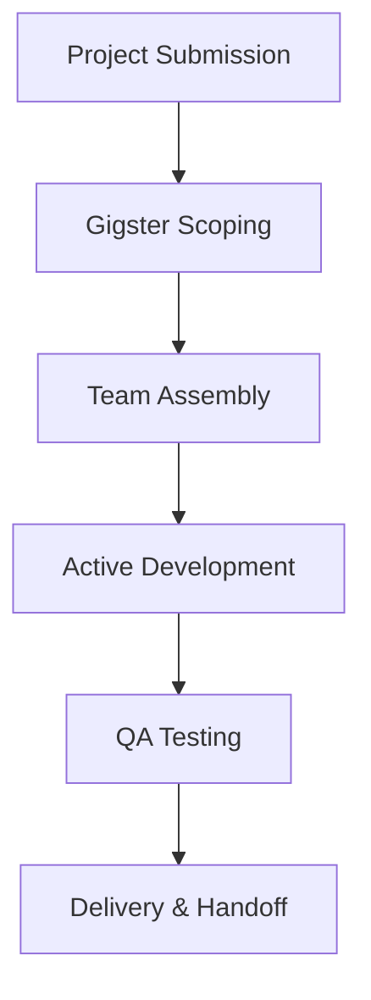

**Category:** Freelance & Gig Platforms
**Difficulty:** Intermediate
**Reading time:** 6 min read

---

Gigster is a managed development platform that handles the full lifecycle of software projects by matching client needs with appropriate developers, managing project execution, and ensuring quality deliverables. The platform functions as a project intermediary, providing quality assurance, timeline management, and accountability while connecting businesses with development teams for web, mobile, and enterprise software projects.

- **Full-Service Project Management** — platform manages project lifecycle and quality
- **Developer Vetting** — extensive screening and skill verification
- **Quality Assurance** — built-in QA and code review processes
- **Time and Material or Fixed Price** — flexible engagement models
- **Project Accountability** — guarantees on delivery quality and timeline

Clients submit project requirements and scope to Gigster. The platform's team assesses project complexity and assembles an appropriate development team from their vetted network of developers. Gigster manages the entire project lifecycle, including sprint planning, progress tracking, quality assurance, and code reviews. The platform assumes responsibility for timeline adherence and quality standards, handling client communication and change management. Upon completion, deliverables undergo rigorous testing before handoff. Gigster's model emphasizes reducing hiring friction while maintaining project accountability and professional execution.

- MVP and startup application development
- Mobile app development (iOS/Android)
- Web platform and SaaS development
- Enterprise software projects
- Legacy system modernization
- Rapid prototyping and proof-of-concepts
- Full-stack application development
- Scaling development teams without hiring

| Advantage | Disadvantage |
|-----------|--------------|
| Full project management included | Less direct developer control |
| Quality assurance built-in | Markup on developer rates |
| Risk transferred to platform | Larger project minimum sizing |
| Professional team assembly | Less customization of team |
| Timeline accountability | Communication through intermediary |

- [Gun.io Developer Marketplace](gunio-developer-marketplace.md)
- [Andela Developer Platform](andela-developer-platform.md)
- [X-Team Remote Developers](x-team-remote-developers.md)

---
*Part of the [Freelance & Gig Platforms](index.md) category · [Back to Master Index](../../index.md)*
