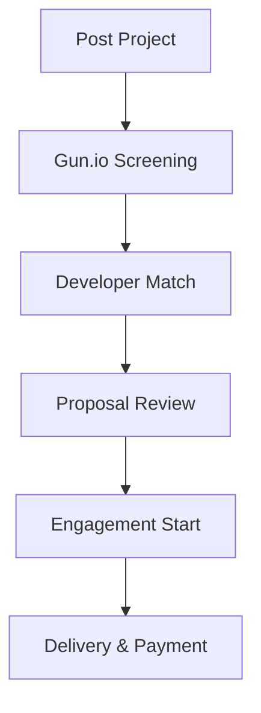

**Category:** Freelance & Gig Platforms
**Difficulty:** Intermediate
**Reading time:** 6 min read

---

Gun.io is a specialized developer marketplace focused on connecting companies with senior and specialized software engineers for short-term to medium-term projects. The platform emphasizes quality through rigorous vetting, specialization matching, and transparent rates, catering to businesses needing development expertise without permanent hiring or managing large engineering teams.

- **Developer Specialization** — focus on software engineers, architects, and technical leads
- **Rigorous Vetting** — technical screening and reference verification required
- **Project-Based Matching** — connects specific project needs with appropriate expertise
- **Transparent Rates** — clear visibility on developer costs and project pricing
- **Short to Medium Engagements** — supports variable project durations

Companies describe their development needs, project scope, required technologies, and preferred timeline. Gun.io's team screens their network of vetted developers to identify qualified matches for the specific project requirements. Matching developers are presented to the company with portfolios, rates, and availability. Once a developer is selected, Gun.io facilitates contract formation, handles payment processing, and provides ongoing support. The platform emphasizes transparent communication and project management throughout the engagement lifecycle.

- Web application development
- Mobile app development
- Backend and API development
- DevOps and infrastructure work
- Technical architecture consultation
- Performance optimization projects
- Legacy system modernization
- Full-stack development projects

| Advantage | Disadvantage |
|-----------|--------------|
| High-quality developer vetting | Smaller marketplace than competitors |
| Specialization matching capability | Less diverse pricing options |
| Transparent rate structures | May have longer matching times |
| Project management support | Premium pricing for senior developers |
| Technical expertise on platform team | Geographic limitations possible |

- [Braintrust Freelance Network](braintrust-freelance-network.md)
- [Gigster Software Development](gigster-software-development.md)
- [Turing AI-vetted Developers](turing-ai-vetted-developers.md)

---
*Part of the [Freelance & Gig Platforms](index.md) category · [Back to Master Index](../../index.md)*
