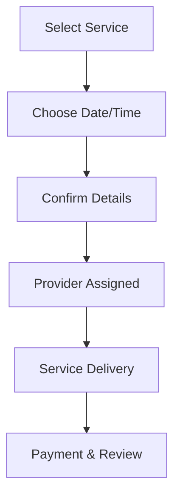

**Category:** Freelance & Gig Platforms
**Difficulty:** Intermediate
**Reading time:** 6 min read

---

Handy is a home services marketplace focused on quick scheduling and reliable execution of common household tasks including cleaning, handyman repairs, assembly, and minor renovations. The platform emphasizes convenience through rapid booking, transparent pricing, and professional vetted service providers available for same-day or next-day service in major cities.

- **Rapid Scheduling** — book services for same-day or next-day availability
- **Fixed Pricing** — transparent prices without surprise charges
- **Professional Vetting** — background checks and skill verification required
- **Service Categories** — cleaning, handyman, assembly, furniture, plumbing basics
- **Reliability Focus** — commitment to on-time arrival and quality completion

Customers browse available services on Handy and select their specific need (cleaning, assembly, repairs, etc.). They input their address and preferred service date and time. The platform shows fixed pricing and available time slots, allowing instant booking. A service professional is automatically assigned based on availability and location. The provider arrives at the scheduled time with tools and materials, completes the work, and customers pay through the app. The model prioritizes predictability and convenience with transparent pricing, background-checked professionals, and a commitment to on-time service.

- Apartment and house cleaning
- Furniture assembly and IKEA setup
- Small handyman repairs
- Light fixtures and mounting
- Basic electrical outlet repairs
- Minor plumbing issues
- Door lock installation
- Shelving and storage installation

| Advantage | Disadvantage |
|-----------|--------------|
| Same-day or next-day availability | Limited to major metropolitan areas |
| Fixed transparent pricing | Less customization for complex jobs |
| Professional vetting and insurance | Service categories more limited |
| Easy instant booking | Quality depends on individual provider |
| No long-term contracts | May not handle major renovations |

- [TaskRabbit Local Services](taskrabbit-local-services.md)
- [Thumbtack Professional Services](thumbtack-professional-services.md)
- [Bark.com Lead Generation](barkcom-lead-generation.md)

---
*Part of the [Freelance & Gig Platforms](index.md) category · [Back to Master Index](../../index.md)*
