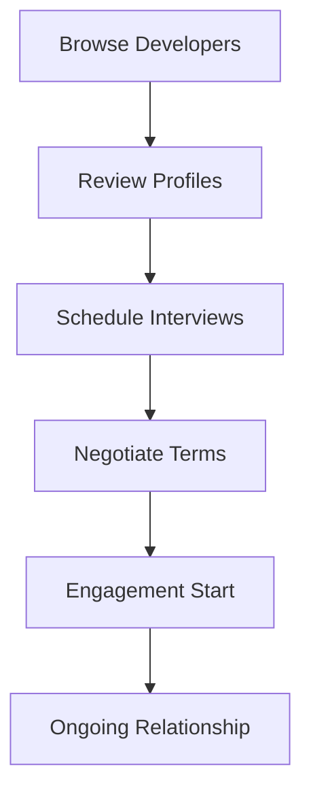

**Category:** Freelance & Gig Platforms
**Difficulty:** Intermediate
**Reading time:** 6 min read

---

Lemon.io is a freelance developer marketplace connecting companies with senior developers from Latin America for project-based and full-time remote work. The platform emphasizes quality through rigorous technical vetting, transparent pricing, and developer specialization, allowing companies to access skilled engineering talent without traditional hiring overhead while supporting developer career growth and compensation.

- **Senior Developer Focus** — emphasis on experienced mid-to-senior level engineers
- **Latin American Talent** — developers primarily from Latin America
- **Technical Vetting** — skills assessment and portfolio verification
- **Flexible Engagement** — both project-based and full-time remote arrangements
- **Fair Compensation** — emphasis on competitive rates and transparent pricing

Companies browse Lemon.io's curated network of vetted developers, reviewing portfolios, experience, rates, and availability. Developers create detailed profiles highlighting their technical skills, past projects, and specializations. Companies can contact developers directly to discuss project requirements, engage in interviews, and negotiate terms. Lemon.io facilitates the matching process but emphasizes direct relationships between clients and developers. Payment is handled through the platform with built-in protections and dispute resolution. The model supports both one-time projects and ongoing retainer arrangements with the same developers.

- Full-stack web development
- Backend and API development
- Frontend React/Vue development
- Mobile app development
- DevOps and cloud infrastructure
- Database design and optimization
- Startup MVP development
- Technical team scaling

| Advantage | Disadvantage |
|-----------|--------------|
| Senior developer network | Smaller talent pool than mega-platforms |
| Transparent and fair rates | Geographic timezone considerations |
| Direct client-developer relationships | Requires client-side management |
| Flexible engagement models | Language considerations possible |
| Quality-vetted professionals | Less platform-level project management |

- [Turing AI-vetted Developers](turing-ai-vetted-developers.md)
- [Braintrust Freelance Network](braintrust-freelance-network.md)
- [X-Team Remote Developers](x-team-remote-developers.md)

---
*Part of the [Freelance & Gig Platforms](index.md) category · [Back to Master Index](../../index.md)*
