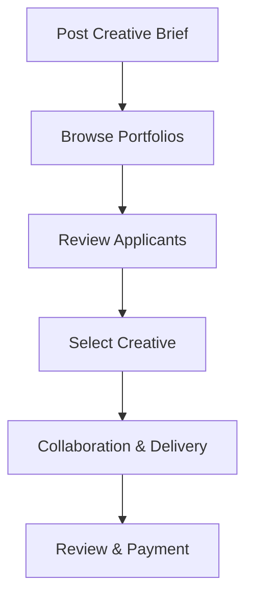

**Category:** Freelance & Gig Platforms
**Difficulty:** Intermediate
**Reading time:** 6 min read

---

Mission is a freelance marketplace specializing in creative professionals including designers, copywriters, illustrators, and creative directors. The platform emphasizes curated talent, portfolio-driven hiring, and project-based work, enabling brands and companies to access specialized creative expertise without permanent staffing while providing creatives with flexible engagement opportunities.

- **Creative Specialization** — focus on design, writing, art, and creative strategy roles
- **Portfolio-Driven Matching** — emphasis on past work and creative quality
- **Project-Based Engagement** — flexible work from single projects to ongoing retainers
- **Brand Collaboration** — focus on brand-level creative partnerships
- **Community of Creatives** — emphasis on supporting and developing creative talent

Companies or brands post creative project briefs describing their needs, aesthetic preferences, timeline, and budget. Creative professionals browse available projects and apply with portfolios, past relevant work, and pricing. Clients review applicants' portfolios and creative direction fit before making selections. Mission facilitates direct communication between clients and creatives, allowing collaborative feedback and iteration. Projects can be one-off engagements or evolve into ongoing retainer relationships. The platform provides payment processing and escrow protections while minimizing platform intermediation in the creative relationship.

- Logo and brand identity design
- Website and UI/UX design
- Content writing and copywriting
- Illustration and visual art
- Motion graphics and animation
- Brand strategy and creative direction
- Photography and creative direction
- Creative consulting and direction

| Advantage | Disadvantage |
|-----------|--------------|
| Portfolio-based quality assessment | Quality subjective and variable |
| Direct creative partnerships | Less platform vetting than some |
| Flexible project engagement | Requires clear creative briefs |
| Access to specialized creatives | Communication overhead per project |
| Supportive creative community | May need multiple iterations |

- [The Creative Group Staffing](the-creative-group-staffing.md)
- [Braintrust Freelance Network](braintrust-freelance-network.md)
- [Thumbtack Professional Services](thumbtack-professional-services.md)

---
*Part of the [Freelance & Gig Platforms](index.md) category · [Back to Master Index](../../index.md)*
