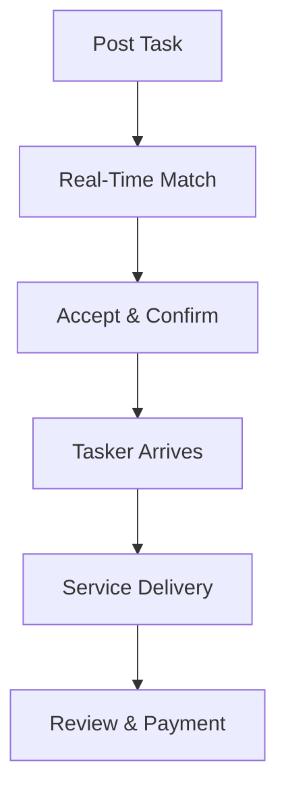

**Category:** Freelance & Gig Platforms
**Difficulty:** Intermediate
**Reading time:** 6 min read

---

TaskRabbit is a gig marketplace connecting users with local service providers for physical tasks like furniture assembly, moving, cleaning, handyman work, and errands. The platform focuses on same-day or next-day service delivery in major metropolitan areas, emphasizing in-person work and time-critical task completion with guaranteed quality and insurance protection.

- **Location-Based Matching** — connects users with taskers in their geographic area
- **Same-Day Service** — emphasis on rapid task completion within 24 hours
- **Tasker Verification** — background checks and skill verification required
- **Service Categories** — furniture assembly, moving, cleaning, handyman, delivery, errands
- **Insurance Coverage** — protection and liability included in pricing

TaskRabbit users post tasks with descriptions, photos, timing preferences, and budgets. The platform uses real-time matching algorithms to connect them with available taskers in their area. Taskers can view tasks and accept matches that fit their schedule and skills. Once matched, users and taskers communicate directly through the app to coordinate timing and details. The tasker completes the work on-site, and the user rates and approves the work through the app. Payment is processed digitally with TaskRabbit handling the transaction and providing insurance coverage for the service.

- Furniture and appliance assembly
- Moving and hauling items
- House cleaning and organization
- Handyman tasks and repairs
- Yard work and landscaping
- Personal assistant tasks and errands
- Trash removal and junk hauling
- Shopping and delivery tasks

| Advantage | Disadvantage |
|-----------|--------------|
| Same-day service availability | Limited to areas with tasker density |
| Pre-vetted professionals | Prices can be higher than direct hiring |
| In-person work capability | Requires physical presence on-site |
| Insurance and protections included | Quality dependent on individual tasker |
| No long-term commitments needed | Rating system means popular taskers book quickly |

- [Thumbtack Professional Services](thumbtack-professional-services.md)
- [Handy Home Services](handy-home-services.md)
- [Fancy Hands Task Assistance](fancy-hands-task-assistance.md)

---
*Part of the [Freelance & Gig Platforms](index.md) category · [Back to Master Index](../../index.md)*
