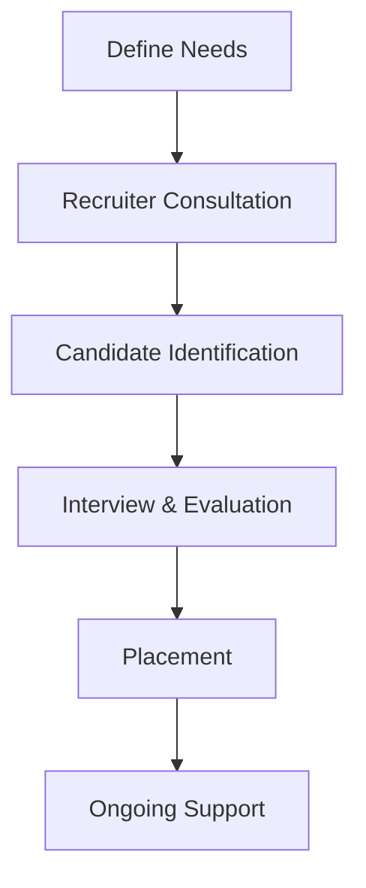

**Category:** Freelance & Gig Platforms
**Difficulty:** Intermediate
**Reading time:** 6 min read

---

The Creative Group is a staffing agency specializing in temporary and permanent placement of creative professionals including designers, art directors, copywriters, and marketing specialists. Operating as a managed staffing service rather than a marketplace, the agency handles recruitment, screening, and placement of vetted creative talent for both short-term projects and permanent positions.

- **Agency Staffing Model** — recruiters manage matching and placement process
- **Creative Professional Focus** — designers, writers, creative directors, art directors
- **Temporary and Permanent** — flexible engagement from projects to full-time hires
- **Recruiter Guidance** — professional matching rather than self-service marketplace
- **Professional Vetting** — background checks and skill verification by experienced recruiters

Companies contact The Creative Group's recruiters with job descriptions and team needs. Recruiters use their professional network and databases to identify qualified candidates matching the requirements. Candidates are screened for skills, experience, and cultural fit through interviews and portfolio reviews. Promising candidates are presented to clients for further evaluation and interviews. The Creative Group negotiates terms, handles contract formation, and manages ongoing support for both employers and employees. The model emphasizes professional guidance and quality matching over self-service marketplace dynamics.

- Temporary project-based creative roles
- Permanent creative position hiring
- Interim creative leadership during transitions
- Design and UX specialist placement
- Content and copywriting staffing
- Art direction and creative direction roles
- Marketing and branding professional staffing
- Design system and creative infrastructure roles

| Advantage | Disadvantage |
|-----------|--------------|
| Professional recruiter guidance | Less direct candidate control |
| Thorough vetting and screening | Longer placement timelines |
| Both temporary and permanent options | Placement fees and markups |
| Expertise in creative hiring | May require flexibility on candidates |
| Ongoing HR and support services | Less transparency in matching |

- [Mission Freelance Creative](mission-freelance-creative.md)
- [Braintrust Freelance Network](braintrust-freelance-network.md)
- [Catalant Consulting Marketplace](catalant-consulting-marketplace.md)

---
*Part of the [Freelance & Gig Platforms](index.md) category · [Back to Master Index](../../index.md)*
