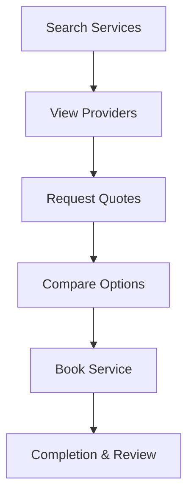

**Category:** Freelance & Gig Platforms
**Difficulty:** Intermediate
**Reading time:** 6 min read

---

Thumbtack is a professional services marketplace connecting customers with local service providers including contractors, cleaners, photographers, movers, tutors, and tradespeople. The platform enables discovery, quote comparison, and booking of verified professionals across hundreds of service categories, functioning as a lead-generation and service discovery platform for both customers and providers.

- **Service Discovery** — broad marketplace covering hundreds of local service categories
- **Quote Comparison** — customers can receive multiple quotes for the same service
- **Verified Professionals** — contractors provide licenses, insurance, and reviews
- **Payment Processing** — optional integrated payment system or direct arrangement
- **Lead Generation** — service providers pay for customer leads and visibility

Customers search for specific services (plumbing, photography, tutoring, etc.) and describe their project needs. Thumbtack connects them with local professionals who can provide quotes. Service providers pay for access to customer leads and are listed based on factors like reviews, responsiveness, and service tier. Customers can request multiple quotes, review provider profiles and past work, and select the best fit. While Thumbtack can facilitate payment, many transactions occur directly between customer and provider. The platform emphasizes transparency through reviews, licenses, and insurance verification.

- Home repair and improvement projects
- Professional photography services
- Cleaning and housekeeping
- Moving and transportation
- Tutoring and educational services
- Beauty and wellness services
- Legal and accounting services
- Event planning and catering

| Advantage | Disadvantage |
|-----------|--------------|
| Wide selection of service providers | Quality variable across professionals |
| Transparent pricing and quotes | Service provider fees reduce competitiveness |
| Reviews and verification available | Payment not always integrated |
| One-stop service discovery | Less relationship continuity than direct hire |
| Useful for comparison shopping | Requires active evaluation of options |

- [TaskRabbit Local Services](taskrabbit-local-services.md)
- [Bark.com Lead Generation](barkcom-lead-generation.md)
- [Handy Home Services](handy-home-services.md)

---
*Part of the [Freelance & Gig Platforms](index.md) category · [Back to Master Index](../../index.md)*
