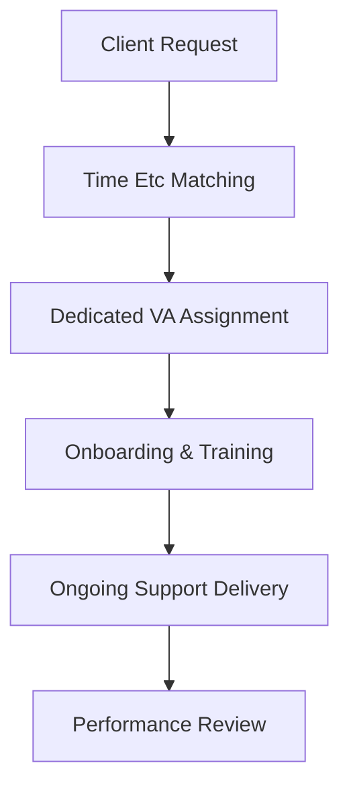

**Category:** Freelance & Gig Platforms
**Difficulty:** Intermediate
**Reading time:** 6 min read

---

Time Etc is a UK-based virtual assistant service that employs and manages a team of administrative professionals available for remote support. The company handles recruitment, training, and ongoing management of assistants, allowing clients to delegate tasks with guaranteed quality and consistency through a structured employment model rather than contractor networks.

- **Employment-Based Model** — assistants are employed by Time Etc, not independent contractors
- **UK-Based Professionals** — teams located in United Kingdom with consistent availability
- **Dedicated Assignment** — typically assigned the same VA for consistency and relationship building
- **Full Managed Service** — company handles HR, payroll, and performance management
- **Scalable Hours** — flexible engagement from part-time to full-time assistant allocation

Time Etc employs virtual assistants directly and manages all HR functions, including recruitment, payroll, benefits, and performance management. When clients engage, the service assigns them a dedicated virtual assistant who becomes familiar with their business processes and preferences. The company provides training to ensure all assistants meet quality standards and can support diverse client needs. Clients pay a fixed rate for hours allocated to their account, which can be adjusted monthly. Time Etc handles quality assurance, sick cover through backup staff, and ensures continuity of service.

- Businesses wanting consistent, dedicated VA relationships
- Companies requiring confidentiality (employment vs. contractor)
- Operations needing business continuity guarantees
- Professional services needing specialized administrative support
- Managing complex scheduling and multi-timezone support
- Long-term administrative infrastructure
- Companies preferring UK-based services

| Advantage | Disadvantage |
|-----------|--------------|
| Employment model ensures stability | Higher cost than contractor networks |
| Dedicated VA builds relationship | Less flexibility in changing assistants |
| Quality guarantees from employer | UK timezone may not suit all clients |
| Continuity through sick cover | Longer-term commitment required |
| Professional management overhead handled | Limited to UK-based professionals |

- [Belay Virtual Assistant](belay-virtual-assistant.md)
- [Fancy Hands Task Assistance](fancy-hands-task-assistance.md)
- [Freelance & Gig Platforms Overview](index.md)

---
*Part of the [Freelance & Gig Platforms](index.md) category · [Back to Master Index](../../index.md)*
