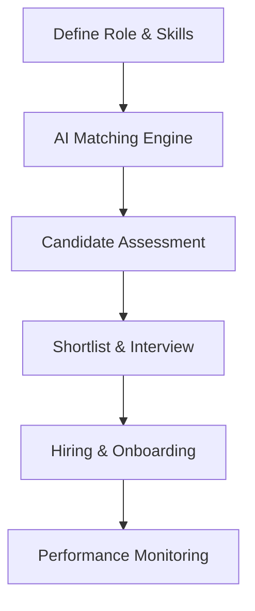

**Category:** Freelance & Gig Platforms
**Difficulty:** Intermediate
**Reading time:** 6 min read

---

Turing is a talent marketplace that uses AI-powered screening and matching to connect companies with pre-vetted software developers from around the world. The platform specializes in identifying and matching specialized technical talent for full-time remote positions, emphasizing engineering quality through algorithmic assessment and continuous performance monitoring to reduce hiring risk and time-to-productivity.

- **AI-Powered Screening** — machine learning algorithms assess technical skills and compatibility
- **Global Talent Pool** — developers from multiple countries with competitive rates
- **Full-Time Remote** — emphasis on permanent positions rather than project work
- **Continuous Monitoring** — platform tracks productivity and performance metrics
- **Quality Guarantee** — refund guarantee if developer doesn't meet performance standards

Companies define technical roles, required skills, and experience levels. Turing's AI algorithms screen a global pool of developers, using technical assessments, portfolio analysis, and behavioral signals to identify qualified matches. Shortlisted candidates are presented to companies for interviews and evaluation. Once hired, developers are onboarded as remote employees or contractors with ongoing performance tracking through productivity metrics and project outcomes. Turing provides performance guarantees, allowing companies to request developer replacement or refunds if performance doesn't meet expectations.

- Building remote engineering teams
- Scaling development capacity
- Specialized technology stack hiring
- Cost-effective senior talent acquisition
- Full-time product development roles
- Reducing time-to-hire and recruitment costs
- Access to global engineering talent
- Long-term technical team expansion

| Advantage | Disadvantage |
|-----------|--------------|
| AI-powered quality matching | Less personal hiring control |
| Global talent access | Timezone and communication overhead |
| Performance guarantees included | Requires full-time commitment |
| Rapid matching and placement | Learning curve for integration |
| Ongoing performance monitoring | May be costlier than direct hiring |

- [X-Team Remote Developers](x-team-remote-developers.md)
- [Lemon.io Vetted Developers](lemonio-vetted-developers.md)
- [Andela Developer Platform](andela-developer-platform.md)

---
*Part of the [Freelance & Gig Platforms](index.md) category · [Back to Master Index](../../index.md)*
