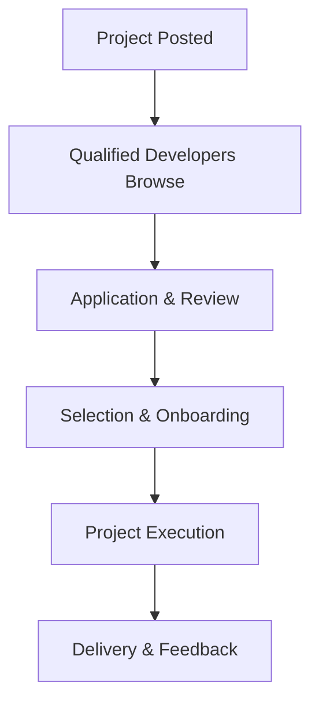

**Category:** Freelance & Gig Platforms
**Difficulty:** Intermediate
**Reading time:** 6 min read

---

X-Team is a developer network connecting remote software engineers with companies seeking specialized technical talent for project-based and ongoing engagement. The platform emphasizes community, professional development, and quality vetting, providing structured support for both developers and clients throughout project engagements while building a sustainable freelance developer ecosystem.

- **Developer Community** — focus on building long-term developer relationships and career
- **Project-Based Matching** — flexible engagement from short projects to long-term retainers
- **Quality Standards** — rigorous technical vetting and portfolio review
- **Community Support** — ongoing training, mentorship, and professional development
- **Transparent Rates** — clear pricing without hidden platform markups

Companies post projects and work opportunities to X-Team with technical requirements, scope, budget, and timeline. Vetted developers review available opportunities and apply with portfolios, skills, and project experience. Companies evaluate applications and select developers based on fit and expertise. X-Team facilitates onboarding, communication, and project management. The platform emphasizes transparency regarding rates, responsibilities, and project scope. Developers have access to community resources, training, and mentorship while companies benefit from structured developer matching and professional project execution.

- Web application development
- Mobile and cross-platform development
- Backend and API development
- DevOps and infrastructure projects
- Full-stack development work
- Short-term consulting projects
- Long-term technical team augmentation
- Specialized technical expertise needs

| Advantage | Disadvantage |
|-----------|--------------|
| Strong developer community support | Smaller talent pool than mega-platforms |
| Transparent rate structures | Requires client-side project management |
| Quality vetting and screening | Matching process may take time |
| Professional development focus | Less platform project management |
| Flexible engagement models | Geographic timezone considerations |

- [Andela Developer Platform](andela-developer-platform.md)
- [Braintrust Freelance Network](braintrust-freelance-network.md)
- [Turing AI-vetted Developers](turing-ai-vetted-developers.md)

---
*Part of the [Freelance & Gig Platforms](index.md) category · [Back to Master Index](../../index.md)*
