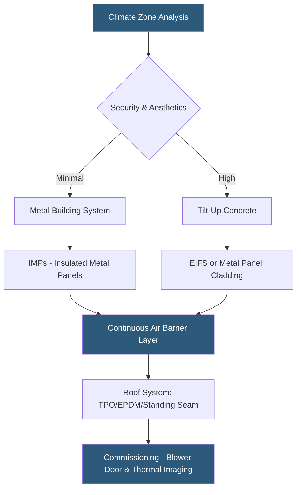

**Category:** Gigawatt Building & Structural
**Difficulty:** Intermediate
**Reading time:** 5 min read

---

The building envelope — walls, roof, and foundation — performs multiple critical functions at gigawatt-scale datacenters: thermal separation of conditioned IT space from outdoor conditions, moisture exclusion, security barrier provision, and aesthetic compliance with local planning requirements. Envelope failures are among the most disruptive and costly defect categories in datacenter operations.

- **Continuous Air Barrier** — uninterrupted membrane preventing uncontrolled air infiltration/exfiltration
- **Thermal Bridging** — conductive heat path through envelope that bypasses insulation, creating condensation risk
- **Dew Point Control** — maintaining interior surfaces above the dew point temperature to prevent condensation
- **Metal Building System (MBS)** — pre-engineered structural steel frame with metal panel wall and roof system
- **Tilt-Up Concrete Panel** — precast wall system where panels are cast on-site and tilted into position
- **Insulated Metal Panel (IMP)** — composite panel with metal facings and foam core providing structure and insulation
- **Vapor Retarder** — membrane controlling moisture diffusion through the envelope assembly
- **Roofing System** — weatherproofing layer over the roof structure, typically TPO, EPDM, or standing seam metal

Gigawatt-scale datacenter envelopes must prevent several failure modes simultaneously. Moisture infiltration through walls or roofs can cause catastrophic short circuits in power distribution equipment; even minor leaks over time cause corrosion of electrical connections and rack hardware. Air infiltration introduces particulates and humidity that degrade IT equipment reliability and accelerate cooling plant runtime.

Metal building systems with insulated metal panel walls are the dominant form for hyperscale single-story facilities because they can be erected rapidly (weeks vs. months for concrete), achieve excellent air tightness with proper detailing, and provide the wall thickness needed for high insulation values (R-25 to R-40). The continuous air barrier is the most critical detail: every penetration for conduit, pipe, or louvre must be sealed with firestopped, weatherproof assemblies.

Tilt-up concrete walls, common in the southwestern US, provide superior blast resistance, ballistic protection, and security deterrence. The concrete mass also provides thermal storage that moderates diurnal temperature swings, beneficial for facilities in hot-dry climates where economizer operation depends on nighttime temperature drops. However, concrete panels are slower to erect and heavier, requiring more substantial foundation systems.

Roofing systems must manage significant ponding risk on low-slope datacenters: even a 1/4-inch per foot slope across a 500 ft roof run creates substantial drainage requirements. Roof penetrations for cooling towers, exhaust fans, and utility risers are each potential leak points requiring specialized flashing details. TPO (thermoplastic polyolefin) membranes are preferred for white reflectance reducing solar heat gain on cooling loads.

- Desert Southwest hyperscale campus using tilt-up panels for blast resistance and thermal mass
- Northeast campus requiring R-30 wall assembly to minimize winter heating of electrical rooms
- Coastal facility with stainless-fastener IMP system resistant to salt air corrosion
- Roof retrofit on 20-year-old facility converting from BUR to TPO for improved reflectance
- Multi-story urban datacenter with architectural cladding required by planning board

| Advantage | Disadvantage |
|-----------|--------------|
| IMP systems erect rapidly, compressing construction schedule | Metal envelopes require precise detailing to prevent condensation at thermal bridges |
| Tilt-up concrete provides superior physical security | Tilt-up requires larger crane equipment and longer panel cure cycles |
| White roof membranes reduce cooling load 5–10% in hot climates | Dark roof finishes in cold climates require supplemental cooling analysis |
| High insulation values reduce heating/cooling energy year-round | Thicker envelope systems reduce interior floor area by 3–6 inches per wall |

- [Roofing Systems for Datacenters](roofing-systems-for-datacenters.md)
- [Thermal Envelope Optimization](thermal-envelope-optimization.md)
- [Modular Building Construction](modular-building-construction.md)

---
*Part of the [Gigawatt Building & Structural](index.md) category · [Back to Master Index](../../index.md)*
