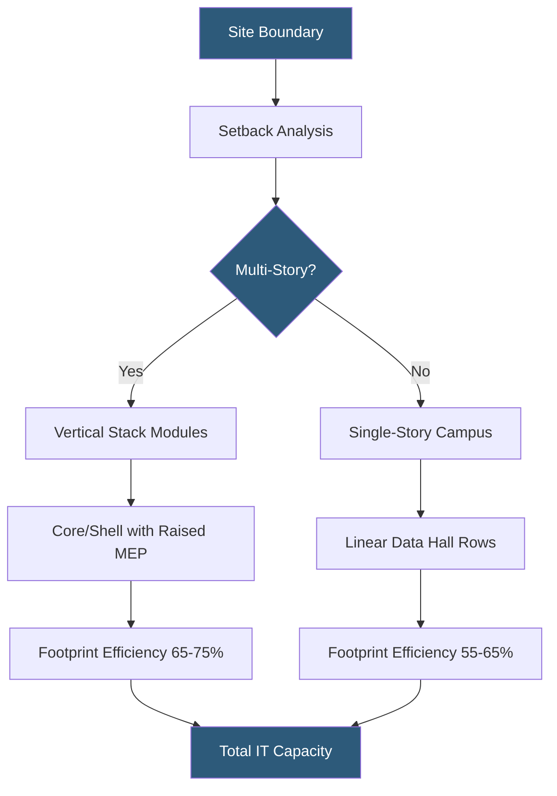

**Category:** Gigawatt Building & Structural
**Difficulty:** Advanced
**Reading time:** 6 min read

---

Building footprint optimization at gigawatt-scale datacenters involves maximizing usable IT floor space per acre while meeting structural, mechanical, and fire egress requirements. Engineers must balance land cost, power density targets, construction phasing, and long-term expansion flexibility within a fixed site boundary.

- **Floor Area Ratio (FAR)** — usable IT floor area divided by total building footprint, key efficiency metric
- **Critical Load Density** — watts per square foot of IT space, driving floor plate depth and cooling routing
- **White Space** — the raised floor or slab area directly occupied by IT equipment racks
- **Gray Space** — mechanical and electrical rooms, corridors, and support areas supporting white space
- **Site Coverage Ratio** — building footprint as a percentage of total site area
- **Column Bay** — repeating structural grid module that defines rack row layouts and equipment access
- **Expansion Module** — pre-planned structural stub-outs allowing future building additions without design rework
- **Setback Requirements** — zoning-mandated minimum distances from property lines affecting usable land

At gigawatt scale, every percentage point of footprint efficiency translates to tens of megawatts of additional deployable capacity within the same land area. Optimization begins with a detailed site analysis: setbacks, easements, utility corridors, and fire department access lanes are subtracted from gross site area to yield buildable area.

Engineers then select a structural grid — typically 30–40 ft column spacing — chosen to accommodate standard 4-ft rack row widths plus hot/cold aisle containment and overhead cable tray. Column bays must align with both structural loads and mechanical distribution routing, so CRAH units, CDUs, and pipe chases fit within gray space without intruding on white space.

Single-story designs maximize floor loading flexibility and simplify mechanical distribution but consume more land. Multi-story designs, increasingly common in land-constrained markets, stack data halls vertically with dedicated MEP floors interleaved between IT floors. This approach can achieve 70%+ white space ratios but demands precise structural engineering for floor-to-floor loads exceeding 200 lbs/sq ft in high-density zones.

Phased expansion is factored in at the design stage: structural grids extend to site boundaries, utility stubs are sized for ultimate build-out, and roof penetrations are pre-sleeved. This avoids the costly rework of retrofit expansion and allows each phase to come online independently. At gigawatt campuses, this means coordinating dozens of building modules, each 20–50 MW, for seamless aggregation.

- Greenfield hyperscale campus in a land-constrained suburban market requiring vertical stacking
- Single-story AI training cluster optimized for 100 kW+ rack density with slab-on-grade coolant routing
- Multi-phase campus where Phase 1 must not impede Phase 5 footprint
- Urban edge datacenter requiring maximum density in minimal land
- Modular deployment where pre-fabricated data hall pods must tile efficiently on an irregular site

| Advantage | Disadvantage |
|-----------|--------------|
| Higher density reduces land acquisition cost per MW | Multi-story adds structural complexity and construction cost |
| Pre-planned expansion avoids retrofit disruption | Fixed column grids limit future high-density rack configurations |
| Optimized gray/white space ratio lowers total build cost | Deep floor plates reduce natural egress options |
| Phased delivery reduces initial CapEx exposure | Footprint optimization may conflict with fire code setbacks |

- [Multi-story vs Single-story Design](multi-story-vs-single-story-design.md)
- [Column Spacing for Flexibility](column-spacing-for-flexibility.md)
- [Modular Building Construction](modular-building-construction.md)

---
*Part of the [Gigawatt Building & Structural](index.md) category · [Back to Master Index](../../index.md)*
