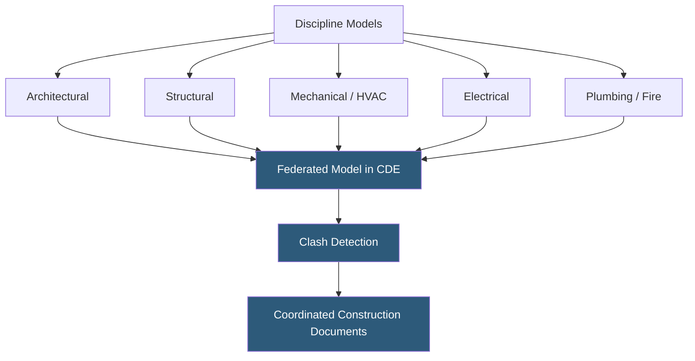

**Category:** Gigawatt Building & Structural
**Difficulty:** Intermediate
**Reading time:** 6 min read

---

Building Information Modeling (BIM) is the process of creating and managing a digital 3D representation of a building's physical and functional characteristics throughout its lifecycle. At gigawatt-scale datacenter projects, BIM coordinates dozens of engineering disciplines in a shared model, reducing costly clashes discovered during construction, accelerating commissioning, and creating the data foundation for ongoing operations and maintenance.

- **BIM LOD (Level of Development)** — a scale from 100 (concept) to 500 (as-built) defining the precision of model elements
- **Clash Detection** — automated identification of intersections between elements from different disciplines (e.g., duct through structural beam)
- **Common Data Environment (CDE)** — a shared cloud repository where all project team members access the authoritative BIM
- **IFC (Industry Foundation Classes)** — an open data format enabling model exchange between different BIM software platforms
- **MEP Coordination** — the process of resolving conflicts between Mechanical, Electrical, and Plumbing models
- **4D BIM** — a 3D model linked to a construction schedule, visualizing build sequence over time
- **5D BIM** — BIM integrated with cost estimation, enabling real-time budget tracking as design changes
- **Digital Twin** — an as-built BIM maintained and updated throughout operations to reflect current facility state

A gigawatt datacenter project involves structural engineers, mechanical engineers, electrical engineers, fire protection engineers, and IT infrastructure designers working simultaneously. Without BIM, these teams produce 2D drawings that are manually overlaid to find conflicts—a slow, error-prone process that typically results in thousands of RFIs (requests for information) during construction.

In a BIM workflow, each discipline builds a 3D model in software such as Autodesk Revit, Bentley MicroStation, or Trimble's Tekla. All models are published to a Common Data Environment daily. Automated clash detection software—Autodesk Navisworks being most common—identifies every geometric intersection between models, generating a clash report. Coordination meetings resolve each clash by negotiating routes, elevations, or structural modifications before issuing construction documents.

On a 500,000 sq ft data hall, BIM coordination typically resolves 5,000–15,000 clashes before construction begins, saving an estimated $3–8 million in field rework costs. MEP coordination is most intensive in electrical rooms where busway, cable tray, conduit, piping, and structural steel compete for the same overhead space.

4D BIM allows the project schedule to be visualized spatially—planners can verify that equipment delivery sequences align with building availability and that critical long-lead items like transformers and switchgear have clear installation paths when needed. After construction, the model is updated to as-built conditions (LOD 500) and handed to the operations team as the foundation for a digital twin supporting CMMS work orders and space management.

- Multi-discipline coordination on large datacenter construction projects
- Prefabrication of MEP racks and modules requiring precise 3D dimensions
- Facilities management and capital planning using as-built models
- Training new operations staff using immersive 3D building walkthroughs
- Regulatory permit submissions where jurisdictions accept BIM-derived drawings

| Advantage | Disadvantage |
|-----------|--------------|
| Clash detection eliminates costly field rework | BIM software licensing and training represents significant upfront cost |
| As-built models support operations for decades | Model quality depends on all disciplines maintaining updates consistently |
| 4D scheduling improves construction logistics | Time invested in BIM coordination can extend pre-construction phase |
| Enables prefabrication with precise dimensional data | Model file sizes become large and slow on complex projects |

- [Modular Building Construction](modular-building-construction.md)
- [Prefabricated Wall Panels](prefabricated-wall-panels.md)
- [Construction Timeline Planning](../gigawatt-datacenter-planning/construction-timeline-planning.md)

---
*Part of the [Gigawatt Building & Structural](index.md) category · [Back to Master Index](../../index.md)*
