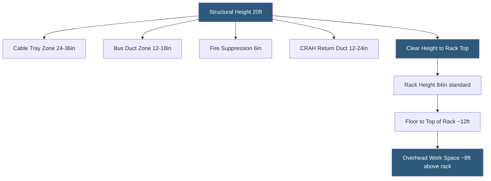

**Category:** Gigawatt Building & Structural
**Difficulty:** Intermediate
**Reading time:** 5 min read

---

Ceiling height in gigawatt-scale data halls directly influences airflow performance, cable management capacity, overhead equipment mounting, and emergency egress. Too low and airflow becomes turbulent and restricted; too high and heating rises stratify warm air above rack tops, degrading cooling efficiency and wasting structural steel cost.

- **Clear Height** — unobstructed vertical distance from finished floor to the lowest overhead obstruction
- **Structural Height** — floor-to-floor dimension minus slab thickness, determining maximum routing space
- **Overhead Zone** — space above rack tops used for cable tray, CRAH return ducts, bus duct, and sprinklers
- **Thermal Stratification** — natural tendency of warm air to rise, creating temperature gradients in tall spaces
- **CRAH Discharge Height** — elevation at which Computer Room Air Handler units deliver cold air to aisles
- **Hot Aisle Capture** — effectiveness of return plenums or overhead ducts at removing exhaust air before recirculation
- **Plenum Pressure** — static pressure in raised floor or overhead CRAH discharge zone, driving airflow to equipment
- **Cable Tray Stack Height** — vertical depth of power and data tray assemblies, typically 24–36 inches

The optimal clear height for a modern gigawatt-scale data hall is 14–16 ft from finished floor to the lowest structural obstruction. This provides 7 ft for standard 42U racks plus approximately 6–8 ft of overhead zone for cable management, power distribution, fire suppression, and HVAC ductwork, while leaving working clearance for technicians on lift equipment during maintenance.

Heights below 12 ft create cascading problems: cable trays and bus duct crowd the zone above racks, CRAH return air paths are restricted, and the vertical distance between server exhaust and cable tray wiring creates thermal soaking that degrades fiber and copper performance over time. Fire suppression nozzles must maintain minimum spacing from structural members per NFPA requirements, further consuming overhead clearance.

Heights above 18 ft introduce thermal stratification risk in non-contained environments, increase structural steel cost for longer-span roof trusses, and add unnecessary lighting and sprinkler cost. In containment designs — where hot aisles are physically enclosed with return ducts — thermal stratification is eliminated and taller heights provide no cooling benefit.

For multi-story buildings, interstitial MEP floors between IT floors are typically 8–10 ft clear height, accommodating chiller connections, CDU manifolds, electrical switchgear, and maintenance access. This adds to overall building height but enables shorter pipe runs between MEP and IT floors compared to routing all services through a mechanical penthouse.

- New 100 kW GPU cluster hall designed for 15 ft clear with direct overhead CDU drops
- Legacy 10 ft clear height facility evaluated for dense GPU retrofit
- Multi-story building with 14 ft IT floors and 9 ft interstitial MEP floors
- Modular data hall container sized for standard shipping container 9.5 ft internal height
- High-ceiling warehouse conversion with 24 ft height requiring thermal stratification analysis

| Advantage | Disadvantage |
|-----------|--------------|
| 14–16 ft clear height accommodates all distribution systems without compromise | Taller buildings require heavier structural steel and more exterior cladding |
| Proper height prevents thermal soaking of overhead cables | Excess height in open environments increases cooling energy for stratified warm air |
| Adequate overhead zone simplifies future cable adds and rerouting | Lower multi-story heights reduce overall building height in planning-restricted sites |
| Standard height specification reduces design effort across campus phases | Non-standard heights create coordination issues with modular prefab systems |

- [Column Spacing for Flexibility](column-spacing-for-flexibility.md)
- [Building Footprint Optimization](building-footprint-optimization.md)
- [Multi-story vs Single-story Design](multi-story-vs-single-story-design.md)

---
*Part of the [Gigawatt Building & Structural](index.md) category · [Back to Master Index](../../index.md)*
