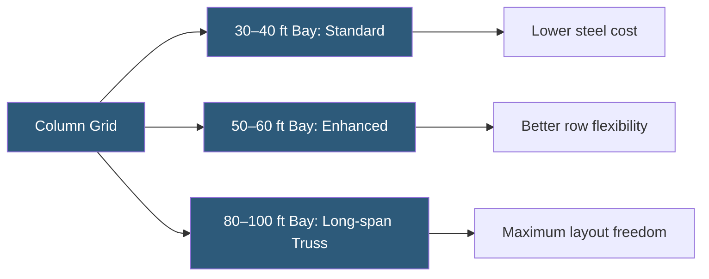

**Category:** Gigawatt Building & Structural
**Difficulty:** Intermediate
**Reading time:** 6 min read

---

Clear span refers to the unobstructed horizontal distance between structural supports in a datacenter building. At gigawatt scale, maximizing clear span enables flexible IT floor layouts, unimpeded airflow management, and easier reconfiguration as compute densities evolve. Structural engineers must balance clear span ambition against cost, deflection limits, and long-term load growth.

- **Clear Span** — the usable width between columns or load-bearing walls with no intermediate supports
- **Bay Width** — the center-to-center distance between structural columns in one direction
- **Deflection Limit** — maximum allowable vertical sag of beams under load (typically L/360 for occupied floors)
- **Moment Frame** — a rigid structural frame that resists lateral and gravity loads without diagonal bracing
- **Long-span Truss** — a deep steel truss enabling spans of 100+ feet with reduced steel weight
- **Dead Load** — permanent structural self-weight plus fixed equipment loads
- **Live Load** — variable loads from IT equipment, personnel, and temporary staging
- **Column-free Zone** — a design target for IT white space that eliminates mid-floor columns

In conventional warehouse construction, column spacing of 30–40 feet is standard. Datacenters demand larger clear spans because server rows, cable trays, and containment systems must run continuously across the floor without column interruption. Industry practice for large-scale datacenters targets column-free zones of at least 50–60 feet in both directions, with premium designs reaching 80–100 feet.

Achieving longer spans requires deeper structural members. A 60-foot span typically uses W-shape wide-flange steel beams with depths of 24–30 inches. For 100-foot spans, open-web steel joists or built-up plate girders become more economical than standard sections. Roof trusses are prefabricated and craned into place in large panels, which also shortens construction schedules.

The structural slab or raised floor must satisfy both live load (IT equipment at 150–250 lbs/sq ft) and deflection limits. Greater spans increase deflection under load, requiring stiffer sections or post-tensioned slabs to maintain flatness tolerances critical for raised floor pedestals.

At gigawatt scale, engineers run parametric structural models varying column spacing in increments to find the optimum cost-per-square-foot point where additional steel weight is offset by operational layout benefits. Most 100 MW+ data halls settle on 50-foot bays as the sweet spot.

- High-density AI training halls requiring wide row configurations
- Multi-tenant colocation requiring flexible, reconfigurable floor plans
- Hyperscaler white space where OCP rack designs change frequently
- Facilities expecting multiple equipment refresh cycles over 25+ year lives
- Tall data halls (16–20 ft clear height) where deep beams are already required

| Advantage | Disadvantage |
|-----------|--------------|
| Eliminates columns that obstruct row layout planning | Longer spans require deeper, heavier steel members |
| Simplifies future IT equipment reconfiguration | Higher structural steel cost per square foot |
| Enables wider hot/cold aisle containment runs | Greater beam depth reduces clear ceiling height |
| Reduces column penetrations through raised floors | Deflection control requires precision detailing |

- [Structural Load Capacity Requirements](structural-load-capacity-requirements.md)
- [Column Spacing for Flexibility](column-spacing-for-flexibility.md)
- [Raised Floor vs Slab-on-Grade](raised-floor-vs-slab-on-grade.md)

---
*Part of the [Gigawatt Building & Structural](index.md) category · [Back to Master Index](../../index.md)*
