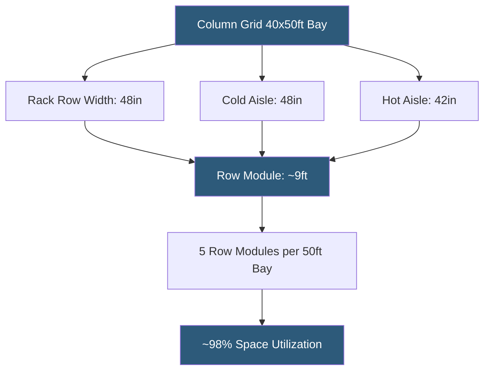

**Category:** Gigawatt Building & Structural
**Difficulty:** Intermediate
**Reading time:** 5 min read

---

Column spacing in datacenter buildings establishes the fundamental geometric grid that governs rack row orientation, aisle widths, equipment placement flexibility, and future reconfiguration options. At gigawatt scale, a poorly chosen column grid forces permanent constraints on layout efficiency and cooling topology that cannot be economically corrected after construction.

- **Structural Bay** — rectangular space between four adjacent columns, the basic unit of floor plan organization
- **Column Grid** — the regular matrix of column locations defining the structural system
- **Clear Span** — unobstructed column-free floor area; larger spans require deeper beams and more steel
- **Rack Row Module** — width of one rack row plus two half-aisle widths, typically 10–12 ft total
- **Aisle Width** — front (cold) aisle typically 42–48 inches; rear (hot) aisle 36–42 inches
- **Perimeter Column** — exterior columns at building edge, typically more constrained than interior columns
- **Girt** — horizontal structural member spanning between columns in exterior wall, supporting cladding
- **Bay Optimization** — alignment of structural grid with equipment grid to minimize wasted space at columns

The standard column grid for hyperscale datacenters has evolved toward 40–50 ft in the direction perpendicular to rack rows and 30–40 ft parallel to rack rows. A 40×50 ft bay accommodates five rack row modules of 9 ft each (four rack rows and five aisles) with minimal waste at column locations, achieving 85–95% utilization of the structural bay for IT equipment.

Columns that intrude into rack rows or aisles create permanent dead zones. A 24×24 ft column grid — adequate for office construction — produces bays that accommodate only two rack rows with awkward leftover space. Retooling the structural grid after construction is impractical; this design error follows a facility for its operational life.

Column sizing also matters: wide flanges (W12 or W14 shapes) at interior locations project only 4–6 inches from the structural centerline, while more complex moment frame columns can reach 12–18 inches. In high-seismic zones where moment frames add lateral stiffness, column sizing must be factored into the effective bay dimensions.

For facilities anticipating liquid cooling deployment, column positions must also coordinate with floor-level coolant distribution manifold routing. Manifolds running in dedicated floor channels between rack rows cannot cross column bases, so column placement must leave clear pathways for coolant supply and return headers.

Modular facility designs often standardize on a specific bay size matching pre-fabricated data hall pod widths, allowing rapid replication across campus phases without re-engineering the structural system. This creates supply chain advantages as structural steel can be fabricated to a standard template.

- New 200 MW campus standardizing on 40×50 ft column grid for all buildings
- Legacy 24×24 ft grid facility analyzing maximum achievable rack density per bay
- AI cluster building optimizing column grid for 60-inch deep liquid-cooled racks
- Seismic moment frame design where wider bays reduce the number of costly rigid connections
- Prefab pod facility aligning structural bays with 60-ft-wide modular data hall pods

| Advantage | Disadvantage |
|-----------|--------------|
| Optimized column grids achieve 90%+ bay utilization | Longer spans require deeper beams and more structural steel cost |
| Standard grid enables prefabricated modular data hall pods | Irregular site shapes may force non-optimal grid orientations |
| Wide bays accommodate multiple cooling topology options | Seismic moment frames with wide bays require expensive connections |
| Grid alignment simplifies cable tray and busway routing overhead | Misaligned columns create permanent obstructions in critical zones |

- [Building Footprint Optimization](building-footprint-optimization.md)
- [Ceiling Height Optimization](ceiling-height-optimization.md)
- [Modular Building Construction](modular-building-construction.md)

---
*Part of the [Gigawatt Building & Structural](index.md) category · [Back to Master Index](../../index.md)*
