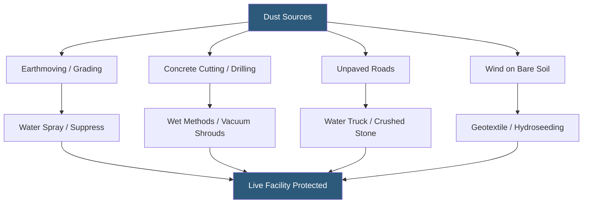

**Category:** Gigawatt Building & Structural
**Difficulty:** Beginner
**Reading time:** 5 min read

---

Construction dust control is a critical operational discipline at gigawatt-scale datacenter sites, particularly when new construction phases occur adjacent to live, operating data halls. Conductive or abrasive dust migrating into active server environments can cause equipment failures, void warranties, and trigger outages. Regulatory dust control also satisfies air quality permit requirements and protects construction workers from silica and particulate exposure.

- **Fugitive Dust** — airborne particles generated by earthmoving, demolition, concrete cutting, and vehicle traffic on unpaved surfaces
- **Positive Pressurization** — maintaining higher air pressure inside operating data halls than outdoors, preventing dust infiltration through gaps
- **Construction Perimeter Barrier** — temporary walls or curtains separating construction zones from live facilities
- **HEPA Filtration** — High-Efficiency Particulate Air filters rated to capture 99.97% of particles 0.3 microns and larger
- **Water Truck** — a vehicle that sprays water on unpaved roads and disturbed soil to suppress dust generation
- **Wind Erosion Control** — windbreaks, geotextile blankets, and vegetation establishment to prevent bare soil from becoming a dust source
- **PM10 / PM2.5** — particulate matter standards measured in microns; PM2.5 is the finer, more dangerous fraction
- **Dust Plan** — a written plan required by many air quality permits specifying dust controls for each construction activity

At gigawatt-scale campuses spanning hundreds of acres, multiple construction phases operate simultaneously with active data halls. Dust control begins with a site-wide dust management plan that identifies all dust-generating activities, required control measures, and responsible parties. The plan is submitted to the local air quality management district (AQMD) and becomes a binding permit condition.

Primary dust suppression on earthmoving operations uses water trucks that make passes every 2–4 hours on active grading areas. On large sites consuming millions of gallons per day, reclaimed water from the site's cooling system or a dedicated storage pond reduces potable water demand. Chemical soil stabilizers—polymers sprayed on finished graded areas—provide longer-lasting dust suppression without continuous water application.

Inside buildings under construction, concrete cutting and grinding with angle grinders or core drills generate crystalline silica dust. OSHA's silica standard (29 CFR 1926.1153) requires either wet methods (water flow during cutting) or engineering controls (vacuum shrouds capturing dust at the source) combined with respirator protection when exposures exceed the action level. Employers must conduct air monitoring to verify control effectiveness.

When construction occurs within 200 feet of live data halls, additional controls are required. Pressurization of the operating building to 0.05–0.1 inches WC positive prevents dust infiltration through door gaps. Pre-filters on all outside air intakes are upgraded to MERV-13 or better during construction, with filter change frequency increased from monthly to weekly.

- Active construction phases adjacent to operating data halls
- Concrete demolition and renovation within live facilities
- Earthmoving on large greenfield campuses near sensitive equipment
- Generator testing involving exhaust soot near air intakes
- Compliance with AQMD permits requiring dust control plans

| Advantage | Disadvantage |
|-----------|--------------|
| Prevents costly contamination events in live data halls | Water truck operations consume large volumes of water in arid regions |
| Regulatory compliance avoids permit violations and fines | Chemical stabilizers add cost compared to water-only suppression |
| Worker health protection reduces liability and lost time injuries | Wet cutting operations generate slurry requiring containment and disposal |
| Positive pressurization of live halls provides a robust engineering control | Increased filter changes during construction add operational cost |

- [Construction Workforce Housing](construction-workforce-housing.md)
- [Vibration Control During Construction](vibration-control-during-construction.md)
- [Building Footprint Optimization](building-footprint-optimization.md)

---
*Part of the [Gigawatt Building & Structural](index.md) category · [Back to Master Index](../../index.md)*
