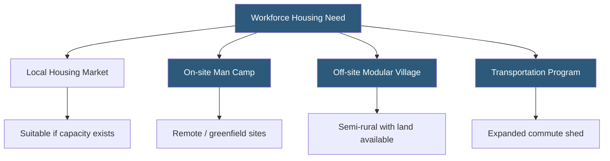

**Category:** Gigawatt Building & Structural
**Difficulty:** Beginner
**Reading time:** 5 min read

---

Gigawatt-scale datacenter projects in remote or semi-rural locations can employ 5,000–15,000 construction workers at peak, overwhelming local housing supply and creating significant community impact. Workforce housing planning—including on-site camps, temporary housing developments, and transportation programs—is an essential component of project planning that affects worker productivity, labor recruitment, community relations, and project costs.

- **Man Camp** — a temporary on-site housing facility with dormitory-style accommodations for remote workers
- **Workforce Housing Study** — an analysis of local housing availability, cost, and capacity relative to project workforce needs
- **Commute Shed** — the geographic area within acceptable commute distance (typically 60–90 minutes) of the project site
- **Modular Housing Unit** — factory-built residential modules assembled on site for temporary or permanent workforce accommodation
- **Community Benefit Agreement (CBA)** — a legally binding agreement between a developer and community organizations addressing local hiring, housing, and other commitments
- **Peak Workforce** — the maximum number of workers on site simultaneously, typically occurring during the structural and MEP installation phases
- **Worker Safety** — workplace health, safety, and welfare provisions required by OSHA and often enhanced by project owner requirements
- **Local Hire** — a commitment to preferentially hire workers from the surrounding community, often negotiated in government agreements

Project developers must conduct a workforce housing study during the planning phase, typically 2–3 years before peak construction. The study surveys available rental housing within the commute shed, identifies hotel and extended-stay capacity, and models the incremental housing demand created by the project workforce—including direct construction employees plus indirect impact from supply chain workers. Most markets cannot absorb a sudden influx of 5,000–10,000 workers without significant rent increases and displacement of existing residents.

Where local housing is insufficient, developers have several options. On-site man camps—temporary compounds with dormitories, cafeterias, recreation facilities, and medical services—are the most self-contained solution for truly remote sites. Well-managed man camps of 2,000–5,000 beds have been operated successfully at major energy projects; they require permitting, utility connections (power, water, sewer), and dedicated security. Build time is 3–6 months for a modular camp of this scale.

In semi-rural areas with land available near the project, temporary modular housing villages are built off-site and made available to workers at subsidized rates. Some hyperscalers have negotiated with local governments to convert temporary construction housing into permanent affordable housing units after project completion, converting an operational challenge into a community benefit.

Transportation programs—chartered buses and van pools—expand the effective commute shed, allowing workers to live in larger urban centers 1–2 hours away. Contractor buses running morning and evening shifts can move 500–1,000 workers per day per route, significantly reducing the required housing units while maintaining worker access to urban amenities.

- Remote greenfield sites in arid or rural regions where local housing is minimal
- Fast-tracked projects with rapid workforce ramp-up outpacing housing market response
- Sites with Community Benefit Agreements requiring local workforce targets
- International projects in developing regions requiring full-service worker camps
- Projects seeking to minimize worker fatigue and commute-related absenteeism

| Advantage | Disadvantage |
|-----------|--------------|
| On-site camps maximize worker availability and minimize absenteeism | Man camp capital cost is $30,000–$80,000 per bed to construct |
| Employer-provided housing supports remote site labor recruitment | Employer-operated housing creates liability and HR management burdens |
| Transportation programs avoid housing construction cost | Long bus rides increase worker fatigue and reduce productivity |
| Subsidized modular villages can become legacy community assets | Requires land acquisition and permitting outside the main project area |

- [Construction Dust Control](construction-dust-control.md)
- [Construction Timeline Planning](../gigawatt-datacenter-planning/construction-timeline-planning.md)
- [Material Logistics at GW Scale](material-logistics-at-gw-scale.md)

---
*Part of the [Gigawatt Building & Structural](index.md) category · [Back to Master Index](../../index.md)*
