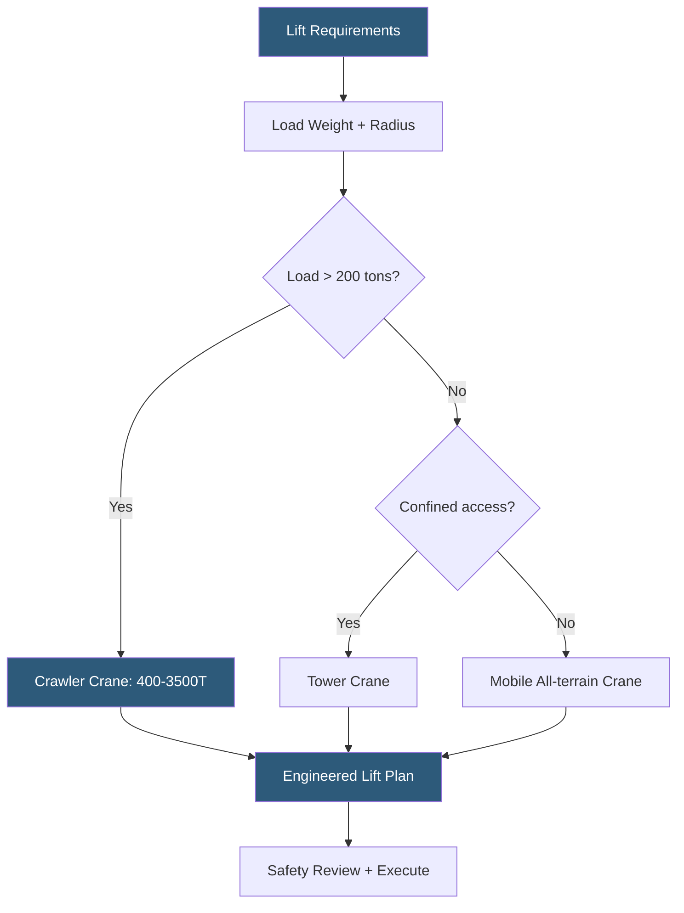

**Category:** Gigawatt Building & Structural
**Difficulty:** Advanced
**Reading time:** 7 min read

---

Crane and rigging operations at gigawatt-scale datacenters involve lifting some of the heaviest individual pieces of equipment ever installed in a building—transformers exceeding 500 tons, cooling towers, chillers, and modular data hall units weighing hundreds of thousands of pounds. Strategic crane selection, rigging engineering, and lift planning are critical for safety, schedule, and cost control across a multi-year construction program involving thousands of individual lifts.

- **Crawler Crane** — a crane mounted on steel tracks; high capacity (up to 3,500 tons) but slow to move; used for heavy equipment setting
- **Tower Crane** — a fixed vertical mast with a horizontal jib; ideal for continuous lifting in confined building sites
- **Mobile Crane** — a rubber-tire or steel-wheel crane; fast repositioning but limited capacity compared to crawler
- **Lift Plan** — an engineered document specifying crane selection, configuration, rigging hardware, and lift radius for a specific load
- **Rigging Hardware** — shackles, slings, spreader bars, and lifting beams used to connect the crane hook to the load
- **Outrigger Pads** — timber or composite pads distributing crane outrigger loads to prevent ground bearing failure
- **Critical Lift** — a lift exceeding 75% of the crane's rated capacity or involving unusual risk; requires enhanced engineering review
- **Pick-and-carry** — moving a suspended load horizontally while traveling; requires specific crane ratings and flat, firm ground

A single gigawatt campus construction program may involve 50,000–100,000 individual crane picks over three to five years. Strategic planning assigns crane types to tasks based on lift weight, radius, frequency, and site access. Tower cranes—typically 10–15 units per large data hall building—handle the continuous flow of structural steel, concrete formwork, and MEP equipment at heights up to 150 feet. Each tower crane covers a 200–250 foot radius and operates simultaneously with adjacent units, requiring careful coordination to prevent boom collisions.

For heavy equipment setting—transformers, large chillers, cooling tower cells, and generator sets—crawler cranes in the 400–1,000 ton class are mobilized. A 500-ton oil-filled power transformer may weigh 600,000 lbs plus rigging; only a large crawler crane can handle such loads at the required radius while maintaining a safety factor of at least 1.25× rated capacity. Crawler crane mobilization costs $200,000–$500,000 per mobilization, so campaign planning batches multiple heavy lifts to justify the setup cost.

All critical lifts require a formal Lift Plan prepared by a licensed rigging engineer. The plan specifies crane model, boom length and configuration, counterweight settings, pick and set points, rigging hardware with rated capacities, ground bearing pressure calculations, and the step-by-step lift procedure. Ground conditions are engineered for each lift location: mats of timber or engineered composite panels distribute outrigger loads over a larger soil area to stay within allowable bearing pressure.

Pre-lift safety meetings involve crane operator, signal person, rigger, and supervisor. All rigging hardware is inspected before use. Taglines control load swing during picks. Weather restrictions are defined—most cranes derate capacity significantly above 20 mph wind speed, and lifts are halted at 35 mph.

- Setting 500-ton power transformers and switchgear onto pre-engineered foundations
- Erecting steel structural frames for large data hall buildings
- Installing cooling tower cells and large chiller units on elevated mechanical platforms
- Placing modular prefabricated datacenter units (PDUs and skids) into position
- Lifting rooftop CRAH units and generator exhaust stacks

| Advantage | Disadvantage |
|-----------|--------------|
| Crawler cranes handle the heaviest lifts safely | Crawler crane mobilization cost is substantial; requires campaign planning |
| Tower cranes provide continuous high-speed lifting in confined areas | Tower crane setup and teardown adds weeks to the schedule |
| Engineered lift plans systematically eliminate safety risks | Formal lift planning adds time and engineering cost to every critical lift |
| Multiple crane types optimized to tasks reduces overall cost | Crane-dense sites require airspace coordination to prevent boom conflicts |

- [Material Logistics at GW Scale](material-logistics-at-gw-scale.md)
- [Modular Building Construction](modular-building-construction.md)
- [Precast Concrete Structures](precast-concrete-structures.md)

---
*Part of the [Gigawatt Building & Structural](index.md) category · [Back to Master Index](../../index.md)*
