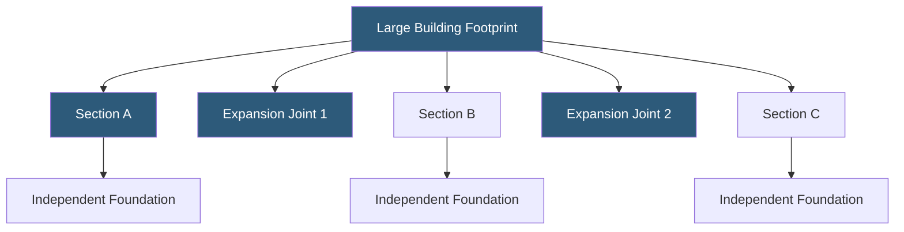

**Category:** Gigawatt Building & Structural
**Difficulty:** Advanced
**Reading time:** 6 min read

---

Expansion joints are planned discontinuities in a building's structure that accommodate thermal movement, differential settlement, and seismic displacement without inducing damaging stresses in the framing or envelope. At gigawatt-scale campuses where buildings exceed 500,000 square feet, proper expansion joint placement is critical to preventing cracking, leaks, and structural damage over decades of operation.

- **Thermal Expansion** — dimensional change in structural steel or concrete due to temperature swings; steel expands ~0.0000065 inches/inch/°F
- **Differential Settlement** — unequal subsidence of building sections on different soil conditions or load regimes
- **Seismic Joint** — a separation gap sized to prevent adjacent building sections from pounding during an earthquake
- **Movement Joint** — generic term covering expansion, contraction, and settlement joints
- **Cover Plate** — a metal plate spanning the joint gap to provide a continuous walking or equipment surface
- **Joint Width** — the gap dimension calculated from expected maximum movement plus safety factor
- **Sealant Backer Rod** — compressible foam behind joint sealant controlling depth and adhesion geometry
- **Fire-rated Joint System** — a joint assembly tested to resist fire passage per UL or FM standards

For steel-framed datacenters, expansion joints are typically placed every 200–300 feet in buildings without temperature control in structural bays. In climate-controlled data halls, thermal gradients are smaller, but construction-stage temperature ranges still drive joint spacing to 400–600 feet maximum. Buildings over 1,000 feet in plan length may require two or three joints.

Each joint divides the structure into independent segments with separate column lines, foundations, and roof systems that are structurally isolated from each other. The joint gap at the building envelope is sized to accommodate the calculated maximum movement: typically 1–2 inches for thermal in moderate climates, larger in seismic zones where codes require gaps equal to the sum of maximum lateral displacements of adjacent structures.

At the floor level, expansion joints must be bridged with cover plate systems that accommodate movement without creating trip hazards. IT equipment rows crossing a joint require special treatment—most designers route rows parallel to joints rather than perpendicular to avoid issues with raised floor pedestals at grade changes.

Roofing expansion joints use prefabricated bellows-type assemblies or split curb details that maintain weatherproofing through full movement cycles. Fire-rated joint systems are required wherever the joint penetrates a fire-rated floor or wall assembly. All sealants must be compatible with the adjacent substrates and rated for the expected temperature range and UV exposure.

- Buildings exceeding 400 feet in length requiring thermal relief
- Campuses with phased construction where new wings adjoin existing structures
- High seismic zones requiring seismic separation between occupied sections
- Facilities built on variable soil conditions with expected differential settlement
- Below-grade tunnels connecting buildings that need independent movement

| Advantage | Disadvantage |
|-----------|--------------|
| Prevents structural cracking and damage over the building life | Creates routing challenges for IT row layouts crossing joints |
| Allows independent settlement of building sections | Joint cover systems require periodic inspection and replacement |
| Reduces thermally-induced stresses in long structures | Fire-rated joint systems add cost and installation complexity |
| Simplifies seismic design by isolating structural sections | Waterproofing at joints is a persistent maintenance focus |

- [Structural Load Capacity Requirements](structural-load-capacity-requirements.md)
- [Foundation Design for Heavy Equipment](foundation-design-for-heavy-equipment.md)
- [Seismic Design Considerations](seismic-design-considerations.md)

---
*Part of the [Gigawatt Building & Structural](index.md) category · [Back to Master Index](../../index.md)*
