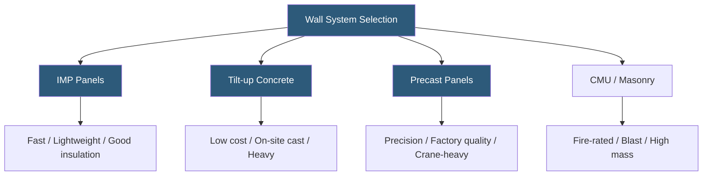

**Category:** Gigawatt Building & Structural
**Difficulty:** Intermediate
**Reading time:** 6 min read

---

Exterior wall systems for gigawatt-scale datacenters must satisfy structural, thermal, fire-resistance, and blast/ballistic requirements while enabling rapid construction across enormous building footprints. The choice of wall system—insulated metal panels, tilt-up concrete, precast, or masonry—affects construction speed, long-term maintenance, acoustic performance, and total cost over the facility's operational life.

- **Insulated Metal Panel (IMP)** — factory-assembled composite panel with steel skins and foam core; dominant in hyperscaler construction
- **Tilt-up Concrete** — panels cast horizontally on the slab then tilted vertical by crane; cost-effective for large footprints
- **Precast Concrete Panel** — factory-cast concrete panels trucked to site and erected; high dimensional accuracy
- **CMU (Concrete Masonry Unit)** — block masonry; used for mechanical/electrical rooms and blast-rated sections
- **Curtain Wall** — non-load-bearing glazing and panel system hung from the structural frame
- **Fire Rating** — hourly classification for how long a wall assembly resists fire penetration; data halls typically require 1–2 hour ratings
- **UL Listing** — Underwriters Laboratories testing certification for fire and performance properties
- **Blast Resistance** — wall's ability to absorb dynamic pressure from an explosion without fragmentation

Insulated metal panels (IMPs) have become the dominant exterior wall choice for hyperscaler datacenters due to their integrated insulation, fast installation, and lightweight nature. A single IMP factory crew can install thousands of square feet per day, dramatically compressing the construction schedule on a 500,000 sq ft building. Panel widths of 42–48 inches allow long uninterrupted runs between penetrations.

Tilt-up concrete construction is preferred at many campuses for its low material cost and the ability to cast panels using the building slab as the casting bed. A 25,000 sq ft building with 30+ panels can be erected in a single day once casting is complete. Tilt-up panels inherently provide thermal mass, fire resistance, and blast resistance but require additional insulation (applied on the interior face) and have limited factory quality control compared to precast.

Precast concrete panels offer superior dimensional control—useful at sites where multiple buildings must align precisely—and can incorporate complex reveals, textures, or embedded connections. However, the logistics of delivering and erecting large precast panels in high volumes creates scheduling constraints.

For mechanical and electrical rooms, security-sensitive areas, or blast-rated sections adjacent to transformer yards, CMU construction remains the practical choice. An 8-inch reinforced CMU wall achieves a 2-hour fire rating and provides significant blast energy absorption without special detailing.

- Primary IT hall exterior walls requiring thermal performance and fast erection (IMP)
- Low-cost warehouse-style generator and transformer enclosures (tilt-up)
- Battery and fuel storage rooms requiring blast resistance (CMU)
- Security fence buildings and guard stations requiring bullet resistance (precast or CMU)
- Architectural showcase facades on campus entrance buildings (precast or curtain wall)

| Advantage | Disadvantage |
|-----------|--------------|
| IMP panels provide integrated insulation and fast installation | IMP panels dent and corrode if not maintained; limited repairability |
| Tilt-up minimizes material cost for large buildings | Tilt-up requires large crane and on-site casting coordination |
| Precast delivers factory quality and durability | Precast logistics limit panel size and delivery frequency |
| CMU provides best fire and blast resistance | CMU is slow to construct and requires more labor |

- [Thermal Envelope Optimization](thermal-envelope-optimization.md)
- [Precast Concrete Structures](precast-concrete-structures.md)
- [Building Envelope Design](building-envelope-design.md)

---
*Part of the [Gigawatt Building & Structural](index.md) category · [Back to Master Index](../../index.md)*
