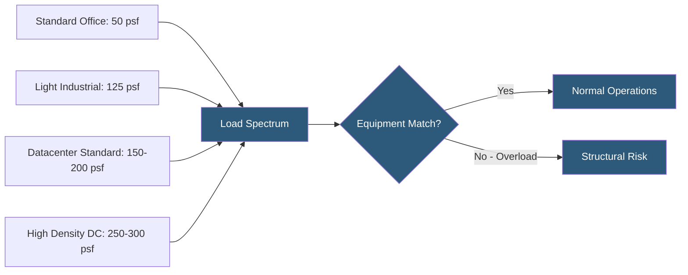

**Category:** Gigawatt Building & Structural
**Difficulty:** Intermediate
**Reading time:** 5 min read

---

Floor loading capacity specifications are among the most frequently underestimated parameters in datacenter design, often discovered too late when high-density AI accelerator racks far exceed the load ratings of existing floors. Understanding the relationship between structural capacity, equipment weight, and load distribution is essential for any gigawatt-scale facility planning exercise.

- **Uniform Live Load** — design load applied over the full floor area, specified in lbs/sq ft (psf)
- **Point Load** — concentrated force from a single rack foot or equipment leg, typically expressed in lbs
- **Dead Load** — self-weight of the structure, raised floor, cable management, and fixed infrastructure
- **Total Design Load** — sum of dead loads, live loads, and any special loads (seismic, snow, wind)
- **Load Path Tributary Area** — floor area contributing load to a single structural member
- **Rack Weight Density** — total rack weight divided by rack footprint, the most relevant operational metric
- **Dynamic Load** — time-varying loads from cooling fans, generators, and vibrating equipment
- **Load Certificate** — formal engineering document certifying a floor's design load capacity

Standard commercial buildings carry 50–80 psf live load; industrial buildings 125 psf. Datacenters are typically designed for 150–250 psf uniform live load to accommodate mixed-density server populations. However, the critical constraint for high-density AI workloads is often not the UDL but the point load at individual rack feet.

A 100 kW GPU rack with cold-plate liquid cooling weighs approximately 5,000–8,000 lbs fully loaded. Distributed across four rack feet, each foot applies 1,250–2,000 lbs on a roughly 4-square-inch pad, producing contact pressures of 300–500 psf locally. Even if the average floor loading across the hall is 200 psf, these localized concentrations can cause punching shear failure in standard 6-inch slabs.

Structural engineers address this with a two-parameter specification: a UDL for overall floor design (e.g., 200 psf) paired with a maximum point load per rack foot (e.g., 2,500 lbs). Equipment procurement must verify against both limits. When point loads exceed slab capacity, solutions include equipment base pads that spread load over larger areas, stiffener plates glued to raised floor panels, or structural slab upgrades.

Legacy facility assessments require original structural drawings, material test reports, and sometimes core samples to determine actual (as-built) capacity. Many older datacenters have undocumented slab variations from construction changes. A formal load capacity certification from a licensed structural engineer is required before deploying high-density equipment in legacy spaces.

- Hyperscale campus specifying 300 psf for dedicated AI accelerator halls
- Legacy colocation assessing suitability for 30 kW liquid-cooled customer deployments
- Battery room design for 500 kW UPS with heavy VRLA battery strings
- Generator building with engine block loads exceeding 400 psf at mount pads
- Multi-tenant facility with variable density zones requiring tiered floor ratings

| Advantage | Disadvantage |
|-----------|--------------|
| Higher design loads future-proof facilities against density increases | Over-designing for 300 psf adds $3–8/sq ft to construction cost |
| Published load certificates enable accurate customer capacity planning | Retroactive load upgrades require facility shutdowns |
| Differentiated load zones allow cost optimization across the campus | Mixed load ratings create operational complexity for equipment placement |
| Point load specifications prevent localized failures from AI racks | Equipment vendors often underspecify rack weights in data sheets |

- [Slab Design for Equipment Loads](slab-design-for-equipment-loads.md)
- [Raised Floor vs Slab-on-Grade](raised-floor-vs-slab-on-grade.md)
- [Structural Load Capacity Requirements](structural-load-capacity-requirements.md)

---
*Part of the [Gigawatt Building & Structural](index.md) category · [Back to Master Index](../../index.md)*
