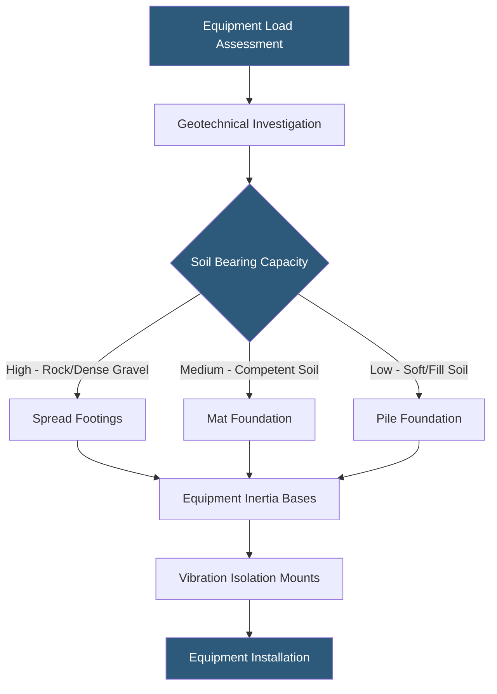

**Category:** Gigawatt Building & Structural
**Difficulty:** Advanced
**Reading time:** 6 min read

---

Foundation design for gigawatt-scale datacenter heavy equipment — including transformers, generators, cooling towers, and UPS battery strings — requires a specialized approach distinct from standard building foundation engineering. Equipment foundation failures are among the costliest and most disruptive structural problems, as they require facility shutdowns and extensive concrete work to remediate.

- **Mat Foundation** — continuous reinforced concrete slab under an entire building or equipment pad, distributing loads broadly
- **Isolated Spread Footing** — individual foundation pad under each column or equipment point, connected by grade beams
- **Equipment Inertia Base** — isolated concrete pad with vibration isolators between equipment and building structure
- **Soil Bearing Capacity** — allowable load per unit area that native soil or engineered fill can support
- **Settlement** — downward movement of foundation under load; differential settlement damages structural connections
- **Pile Foundation** — deep foundation elements driven or drilled into load-bearing soil or rock below surface layers
- **Grade Beam** — horizontal concrete beam at grade level connecting footings and distributing lateral loads
- **Vibration Isolation** — spring-based or elastomeric mounts preventing equipment vibration from transmitting to structure

Foundation design begins with a geotechnical investigation: borings and test pits to characterize soil stratigraphy, density, and bearing capacity to depths of 20–50 ft below grade. For gigawatt campuses covering hundreds of acres, multiple boring locations are needed because soil conditions vary across large sites. The geotechnical report specifies allowable bearing pressure (typically 2,000–6,000 lbs/sq ft for competent native soils), required embedment depth, and any ground improvement recommendations.

Outdoor heavy equipment — transformers weighing 40,000–200,000 lbs each, generators at 20,000–80,000 lbs, and cooling towers — typically sits on isolated reinforced concrete pads, 12–18 inches thick with rebar at 12-inch centers each way, anchored to spread footings or piles. Transformer pads require a containment curb and oil-tight lining to manage potential dielectric fluid spills. Generator pads must accommodate fuel day tank loads, exhaust system support, and vibration isolation.

Cooling towers present unique foundation challenges because they combine heavy static loads (water-filled basin weight) with dynamic vibration from fan motors and water distribution systems. Inertia bases — concrete pads weighing 1.5–2x the equipment weight, mounted on spring isolators — decouple fan vibration from the building structure. This is critical to prevent harmonic resonance propagation into adjacent IT spaces.

For indoor equipment such as UPS battery strings and large transformers, slab-on-grade construction with thickened footprint pads (12–18 inches vs. standard 6-inch slab) or pit-style housekeeping pads provides adequate capacity. In multi-story buildings, heavy equipment must be located at grade level or on purpose-designed structural bays with post-tensioned transfer beams.

- 20 MW transformer bank pad design in clay soil requiring pile foundation
- Generator farm with 50 units on individual isolated pads with oil containment
- Cooling tower inertia base design to meet 0.01g vibration limit in adjacent server room
- UPS battery string pad in basement level of multi-story facility
- Post-earthquake settlement analysis of equipment pads in liquefiable soil zone

| Advantage | Disadvantage |
|-----------|--------------|
| Purpose-designed pads prevent differential settlement damage | Specialized foundation engineering adds 4–8 weeks to design schedule |
| Vibration isolation protects sensitive IT equipment from mechanical noise | Inertia bases add 30–50% to equipment pad cost |
| Mat foundations simplify future equipment repositioning | Deep pile foundations in poor soil add $500K–$2M per building |
| Proper containment prevents environmental contamination events | Oversizing pads wastes concrete and site space |

- [Slab Design for Equipment Loads](slab-design-for-equipment-loads.md)
- [Structural Load Capacity Requirements](structural-load-capacity-requirements.md)
- [Seismic Design Considerations](seismic-design-considerations.md)

---
*Part of the [Gigawatt Building & Structural](index.md) category · [Back to Master Index](../../index.md)*
