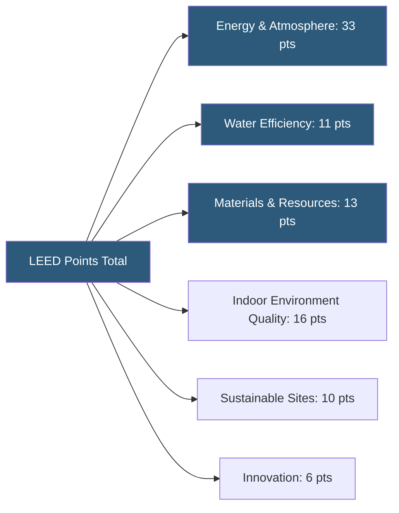

**Category:** Gigawatt Building & Structural
**Difficulty:** Beginner
**Reading time:** 5 min read

---

Green building certification programs like LEED (Leadership in Energy and Environmental Design) provide third-party validation that a datacenter facility meets defined sustainability benchmarks across energy, water, materials, and site categories. At gigawatt scale, certifications serve as public commitments to responsible development and can influence permitting, community relations, and investor ESG ratings.

- **LEED** — the most widely adopted green building rating system globally, administered by the U.S. Green Building Council (USGBC)
- **LEED v4.1** — the current version with stronger emphasis on energy performance and embodied carbon
- **Credit Categories** — LEED is organized into energy, water, materials, indoor environment, site, and innovation categories
- **Certified / Silver / Gold / Platinum** — the four LEED certification levels based on total points achieved (40/50/60/80+)
- **ASHRAE 90.1** — the energy efficiency standard that LEED energy credits are benchmarked against
- **Embodied Carbon** — CO2 emissions from the manufacture, transport, and installation of building materials
- **BREEAM** — the British equivalent of LEED, used in European datacenter projects
- **Living Building Challenge** — a more demanding certification requiring net-positive energy, water, and waste

LEED certification for a datacenter begins with project registration on the USGBC's LEED Online platform. The design team selects target credits based on what the project can reasonably achieve, working toward a minimum point threshold for the desired certification level. Most gigawatt datacenter projects target LEED Gold (60+ points) as a balance of meaningful sustainability achievement and construction cost impact.

The largest point opportunity—and the most critical for operational cost—is in the Energy and Atmosphere category. Datacenters can earn up to 18 points for energy performance by demonstrating PUE and total energy use intensity (EUI) below the ASHRAE 90.1 baseline through an energy model. Other high-value credits include water reduction (WUE improvement through cooling tower efficiency), use of recycled and regional materials, and construction waste diversion from landfills.

The certification process requires documentation submitted through LEED Online, reviewed by the Green Business Certification Inc. (GBCI). For large projects, preliminary design reviews (at 50% and 90% construction documents) reduce the risk of discovering disqualifying issues after construction. Full certification typically takes 3–6 months after construction completion.

Hyperscalers—Google, Microsoft, Meta, Amazon—use LEED and equivalent certifications as part of their sustainability reporting. Some facilities pursue LEED Zero Carbon or LEED Zero Energy certification, which require 100% renewable energy matching and net-zero operational carbon, respectively.

- Hyperscaler campuses with public sustainability commitments
- Data centers in municipalities requiring green building standards for permits
- Facilities seeking lower property taxes through green certification incentives
- Corporate HQ data halls where ESG reporting requires certified metrics
- EU facilities requiring compliance with EU Taxonomy sustainable finance standards

| Advantage | Disadvantage |
|-----------|--------------|
| Third-party credibility for sustainability claims | Certification fees and documentation add cost to projects |
| Can unlock tax incentives and favorable financing | LEED energy credits poorly calibrated for datacenter-specific operations |
| Improves community relations and permitting outcomes | Achieving Platinum level may require expensive design trade-offs |
| Provides a structured framework for sustainability goals | Documentation burden is significant on already complex projects |

- [Sustainable Building Materials](sustainable-building-materials.md)
- [Building Envelope Design](building-envelope-design.md)
- [Thermal Envelope Optimization](thermal-envelope-optimization.md)

---
*Part of the [Gigawatt Building & Structural](index.md) category · [Back to Master Index](../../index.md)*
