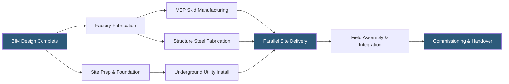

**Category:** Gigawatt Building & Structural
**Difficulty:** Advanced
**Reading time:** 6 min read

---

Modular construction is transforming gigawatt-scale datacenter delivery, enabling parallel manufacturing of pre-engineered building components while site preparation proceeds simultaneously, compressing traditional 24–36 month construction timelines to 12–18 months. The approach trades site-by-site customization for factory quality control and rapid replication across a global campus portfolio.

- **Pre-Engineered Building (PEB)** — steel structure designed and fabricated to standard specifications at factory, assembled on-site
- **Prefabricated MEP Module** — factory-assembled mechanical, electrical, and plumbing skid delivered to site ready for connection
- **Data Hall Pod** — complete IT enclosure with integrated cooling, power distribution, and cable management, factory-built
- **Building Information Modeling (BIM)** — 3D digital model used to coordinate structural, MEP, and architectural systems before fabrication
- **Design for Manufacture and Assembly (DfMA)** — design philosophy optimizing components for factory production and rapid field assembly
- **Structural Integration Tolerance** — allowable dimensional variation between factory-built modules during field connection
- **Fast-Track Construction** — overlapping design, procurement, and construction phases to minimize total project duration
- **Commissioning Pod** — factory-tested system module delivered to site with verification test data included

Modular construction at gigawatt scale begins with a standardized reference design: a building module typically 60–120 ft wide and 300–600 ft long that contains a fixed number of rack rows, power capacity, and cooling infrastructure. This reference design is engineered once to a high standard, then replicated across dozens or hundreds of building modules across a campus over multiple years.

Factory fabrication of structural components, MEP skids, and pre-wired electrical assemblies proceeds in parallel with site work, eliminating the traditional sequential dependency between foundation completion and superstructure erection. Pre-engineered building manufacturers can fabricate a complete steel package — columns, beams, purlins, girts, and roofing — in 8–12 weeks from release to fabrication, compared to 20–30 weeks for custom structural steel.

MEP module skids — switchgear lineups, UPS systems with bypass, transformer assemblies, and cooling CDU manifolds — are wired, piped, and factory-tested at specialist manufacturers. Site work requires only making utility connections at module interface points (dedicated utility connection zones designed into the standard module boundary). Factory testing catches wiring errors and configuration issues in a controlled environment with immediate access to test instruments and specialist technicians, reducing field commissioning time by 40–60%.

The critical challenge in modular construction is tolerance management: factory-built modules must interface precisely with adjacent modules and with civil work executed by separate field teams. BIM coordination and detailed interface drawings define connection point locations to ±1/4 inch, with shimming provisions for field tolerance accumulation.

- 500 MW AI campus requiring 25 identical 20 MW building modules over 5 years
- Emergency expansion deploying 100 MW of capacity in 9 months for cloud customer commitment
- International expansion replicating US reference design in three countries simultaneously
- Enterprise campus using standardized 5 MW colocation modules for tenant fit-out
- Modular generator farm with 20-unit identical skids allowing parallel commissioning

| Advantage | Disadvantage |
|-----------|--------------|
| Parallel manufacture and site work reduces delivery time 30–50% | Standardized modules reduce flexibility for unique site or customer requirements |
| Factory quality control improves MEP assembly quality vs field work | Module transportation adds cost and logistics complexity |
| Repeatable design reduces engineering cost on subsequent phases | Upfront engineering investment for reference design is substantial |
| Factory testing reduces field commissioning time and defects | Tight tolerances require precise site civil work for module alignment |

- [Building Footprint Optimization](building-footprint-optimization.md)
- [Prefabricated Wall Panels](prefabricated-wall-panels.md)
- [Building Information Modeling (BIM)](building-information-modeling-bim.md)

---
*Part of the [Gigawatt Building & Structural](index.md) category · [Back to Master Index](../../index.md)*
