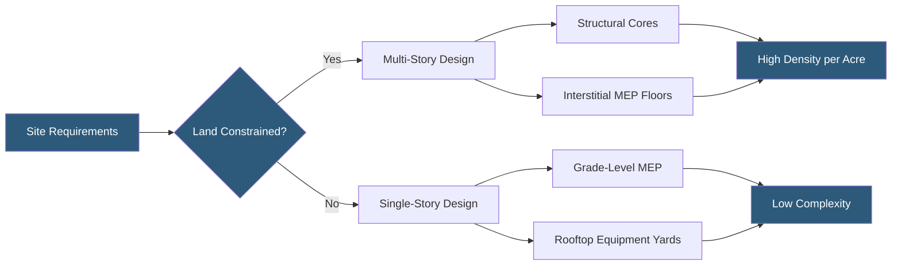

**Category:** Gigawatt Building & Structural
**Difficulty:** Advanced
**Reading time:** 7 min read

---

The choice between multi-story and single-story datacenter construction is one of the most consequential decisions in gigawatt-scale facility design, affecting land use, structural cost, mechanical routing complexity, fire egress, and long-term operational flexibility. Each approach has clear application domains driven by power density targets and site constraints.

- **Floor-to-Floor Height** — vertical distance between structural slabs, typically 16–20 ft for single-story, 14–16 ft per floor in multi-story
- **Interstitial Floor** — dedicated MEP floor between IT floors in multi-story designs, eliminating overhead congestion
- **Structural Live Load** — design floor loading accounting for UPS, battery, and server rack weights, often 250–300 lbs/sq ft
- **Mechanical Penthouse** — rooftop mechanical room housing chillers, cooling towers, and air handling in multi-story designs
- **Fire Egress Stairwell** — code-mandated evacuation path, consuming significant floor plate area in multi-story buildings
- **Core Configuration** — placement of vertical shafts (stairs, elevators, mechanical risers) relative to data hall floor plates
- **Slab Deflection** — structural movement under concentrated rack loads, requiring stiffened bays at high-density zones

Single-story construction is the dominant form for greenfield hyperscale campuses where land is available. Buildings typically span 100,000–500,000 sq ft per structure, with roof heights of 30–40 ft to accommodate overhead cable tray, CRAH units on raised floors, and structural steel. MEP equipment sits in grade-level rooms adjacent to or below the data hall slab, minimizing pipe run lengths and simplifying maintenance access. Roof-mounted cooling towers and condensing units have direct structural connections without floor-penetration complexity.

Multi-story designs, common in Tokyo, Singapore, London, and other land-scarce markets, stack two to six IT floors. Each floor pair typically shares a mechanical interstitial level where chillers, CDUs, and electrical switchgear are located within 20 ft of the IT equipment they serve. Structural engineers must design for concentrated loads from liquid cooling distribution manifolds and transformer pads, requiring post-tensioned or reinforced concrete slabs. Vertical pipe shafts and bus risers add coordination complexity but reduce lateral distribution losses.

The critical differentiator at gigawatt scale is power density trajectory. Single-story buildings can accommodate any cooling technology retrofit because floor slabs can be core-drilled for liquid supply/return without compromising upper floor structure. Multi-story buildings must pre-engineer liquid cooling penetrations, making technology transitions more complex. However, multi-story designs can achieve 2–3x the IT capacity per site acre, a decisive advantage where land costs exceed $5M/acre.

- Tokyo hyperscale campus requiring 200 MW in 5 acres, mandating multi-story
- Phoenix greenfield AI training facility at 150 kW/rack on single-story slab
- London edge colocation with 4-story design to meet planning height limits
- Campus master plan using single-story for Phase 1 with multi-story Phase 2 reserved
- Singapore cloud provider building 6-story tower with 12 MW per floor

| Advantage | Disadvantage |
|-----------|--------------|
| Multi-story maximizes capacity per acre | Multi-story increases construction cost 20–35% per MW |
| Single-story simplifies MEP routing and maintenance | Single-story consumes more land, increasing site acquisition cost |
| Single-story allows any cooling retrofit without structural impact | Multi-story fire egress requires multiple stairwells per floor |
| Multi-story reduces external utility run lengths | Single-story roof loads from cooling equipment require heavy structure |

- [Building Footprint Optimization](building-footprint-optimization.md)
- [Structural Load Capacity Requirements](structural-load-capacity-requirements.md)
- [Ceiling Height Optimization](ceiling-height-optimization.md)

---
*Part of the [Gigawatt Building & Structural](index.md) category · [Back to Master Index](../../index.md)*
