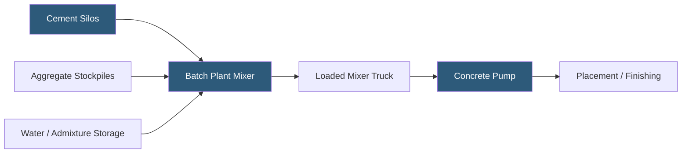

**Category:** Gigawatt Building & Structural
**Difficulty:** Intermediate
**Reading time:** 6 min read

---

On-site concrete batching plants are mobile or semi-permanent mixing facilities installed directly at gigawatt-scale construction sites to produce custom concrete mixes on demand. When a project requires millions of cubic yards of concrete over several years, on-site batching reduces material cost, improves mix quality control, shortens haul times, and eliminates dependence on commercial ready-mix plants whose capacity and scheduling flexibility may be insufficient for peak demand.

- **Batch Plant** — a mixing facility combining cement, aggregates, water, and admixtures to produce ready-mix concrete
- **Transit Mix** — concrete mixed in the drum of a truck during transport from a commercial plant to the site
- **Central Mix** — concrete mixed in a stationary drum then loaded into a truck for transport; higher quality than transit mix
- **Cylinder Strength** — the compressive strength of a 6×12 inch concrete test cylinder, cured and tested at 28 days
- **Slump** — a measure of fresh concrete workability; the drop in height of a standard cone of concrete placed on a flat surface
- **Admixture** — a chemical added to concrete to modify properties (accelerators, retarders, plasticizers, SCMs)
- **Aggregate Stockpile** — on-site storage piles for sand and coarse gravel fed into the batch plant
- **Concrete Pump** — a high-pressure pump that moves fresh concrete through hoses to the placement location

A 1 GW campus with 10 data hall buildings averaging 250,000 sq ft each, plus mechanical buildings, foundations, and site paving, may require 500,000–1,000,000 cubic yards of concrete over a 3–5 year construction period. At peak foundation and slab pours, a single large building may consume 5,000–8,000 cubic yards in a 24-hour continuous pour—beyond the capacity of all local commercial ready-mix plants combined.

On-site batch plants eliminate the commercial supply constraint. A typical 300–500 cubic yard/hour central mix plant can support continuous pours by maintaining a fleet of site mixer trucks. Cement is delivered by pneumatic tanker trucks and stored in vertical steel silos with 500–2,000 ton capacity. Aggregates arrive by truck or rail and are stockpiled in bays adjacent to the plant for rapid loader access.

Mix design control at an on-site plant is superior to commercial transit mix. Every batch is weighed precisely using automated controls, and mix designs with high SCM content (30–50% fly ash or slag) can be executed consistently. Quality control technicians perform slump tests, air content measurements, and cast test cylinders on every 50–100 cubic yard interval. Cylinders are tested at 7 and 28 days to confirm strength development.

On-site batching also supports sustainable mix designs that commercial plants may not stock. Site-specific high-SCM formulations reduce embodied carbon and are produced on demand. The plant can also produce specialty mixes—high-early-strength for accelerated formwork removal, flowable fill for utility trench backfill, or colored architectural concrete for campus entrances—without sourcing from multiple suppliers.

- Mass concrete pours for building foundations and slabs on grade
- Large continuous wall and elevated slab pours requiring uninterrupted supply
- Sites remote from commercial concrete plants where delivery time exceeds 90 minutes
- Projects requiring specialty mix designs not available commercially
- Programs with aggressive schedules requiring 24/7 pour operations

| Advantage | Disadvantage |
|-----------|--------------|
| Eliminates commercial plant capacity constraints at peak demand | Capital cost of plant setup: $500K–$2M depending on capacity |
| Superior mix design control and consistency | Requires dedicated QC staff and laboratory on site |
| Enables specialty and high-SCM mix designs | Environmental permitting required for plant operation (water discharge, air quality) |
| Reduces concrete cost by $15–40 per cubic yard vs. commercial supply | Plant setup and teardown adds weeks to mobilization and demobilization |

- [Material Logistics at GW Scale](material-logistics-at-gw-scale.md)
- [Foundation Design for Heavy Equipment](foundation-design-for-heavy-equipment.md)
- [Sustainable Building Materials](sustainable-building-materials.md)

---
*Part of the [Gigawatt Building & Structural](index.md) category · [Back to Master Index](../../index.md)*
