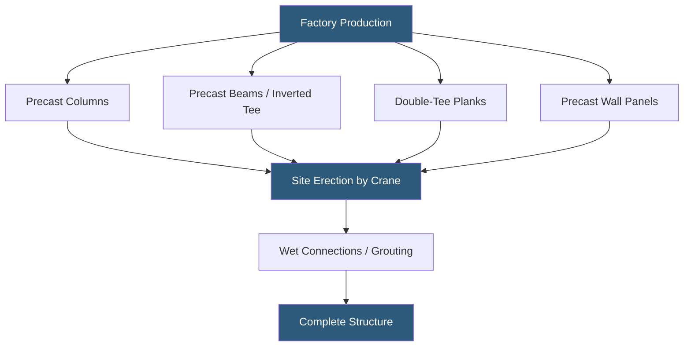

**Category:** Gigawatt Building & Structural
**Difficulty:** Advanced
**Reading time:** 6 min read

---

Precast concrete structures use factory-cast structural elements—columns, beams, double-tee floor planks, and wall panels—that are trucked to the jobsite and assembled by crane. At gigawatt-scale datacenter campuses, precast offers an accelerated construction timeline, high structural performance, and integrated fire resistance without field-applied fireproofing, making it competitive with steel framing for certain building types and site conditions.

- **Double-Tee Plank** — a precast floor or roof element with two downward stems, spanning 50–80 feet between supports
- **Hollow-core Slab** — a precast floor element with longitudinal voids reducing weight while maintaining span capacity
- **Precast Column** — factory-cast column with integral corbels for beam bearing and connection hardware
- **Inverted Tee Beam** — a precast beam with ledges on both sides supporting floor plank ends
- **Wet Connection** — a structural connection using cast-in-place concrete poured around precast reinforcement to create monolithic behavior
- **Prestressing** — high-strength steel tendons pre-tensioned before casting or post-tensioned after, increasing span capacity
- **Erection Sequence** — the planned order of precast placement ensuring stability at each stage before permanent connections
- **PCI Design Manual** — the Precast/Prestressed Concrete Institute's authoritative reference for structural precast design

Precast concrete production takes place in a manufacturing plant under controlled temperature, humidity, and quality supervision. Concrete mix designs achieve 5,000–8,000 psi compressive strength—significantly higher than typical cast-in-place field concrete. Pre-tensioning systems stress high-strength strand to 70% of its ultimate capacity before casting; when the concrete cures and the strand is released, it imparts a compressive pre-stress that counteracts service loads, enabling spans of 60–80 feet for double-tee roof planks.

On a gigawatt campus, precast framing is used for single-story data hall buildings where the roof framing spans between column lines at 50–60 foot bays. A typical data hall module might use 24 double-tee planks spanning 60 feet, requiring a single day of crane erection after column and beam placement. The speed advantage over structural steel depends on lead time: precast fabrication typically takes 8–14 weeks, and the erection sequence must be carefully coordinated with the plant's production schedule.

Connections between precast elements use a combination of embedded steel plates welded in the field and cast-in-place concrete poured into joints and column-beam pockets. These wet connections are designed to provide the structural continuity required for seismic resistance and diaphragm action.

Fire resistance is inherent in precast concrete: concrete cover over reinforcement of 1.5–2 inches provides 2–3 hour fire ratings without spray-applied fireproofing, which is a significant construction cost and schedule advantage. Mechanical penetrations through precast floor planks require pre-planned sleeve inserts; field coring precast double-tees is expensive and structurally risky.

- Data hall roof framing with long-span double-tee planks
- Multi-story electrical room buildings requiring high fire ratings
- Perimeter security walls and blast-rated enclosures
- Generator and transformer housings with long-term durability requirements
- Cold regions where field-placed concrete quality is weather-dependent

| Advantage | Disadvantage |
|-----------|--------------|
| Inherent fire resistance eliminates spray fireproofing costs | Long fabrication lead times require early engineering commitment |
| High factory-controlled concrete quality | Limited flexibility for late design changes after fabrication begins |
| Fast site erection with small crane crews | Heavy elements require large cranes and engineered rigging plans |
| Integrated structural and enclosure function reduces trades | MEP penetrations must be pre-planned; field coring is costly |

- [Structural Load Capacity Requirements](structural-load-capacity-requirements.md)
- [Steel Structure vs Concrete](steel-structure-vs-concrete.md)
- [Foundation Design for Heavy Equipment](foundation-design-for-heavy-equipment.md)

---
*Part of the [Gigawatt Building & Structural](index.md) category · [Back to Master Index](../../index.md)*
