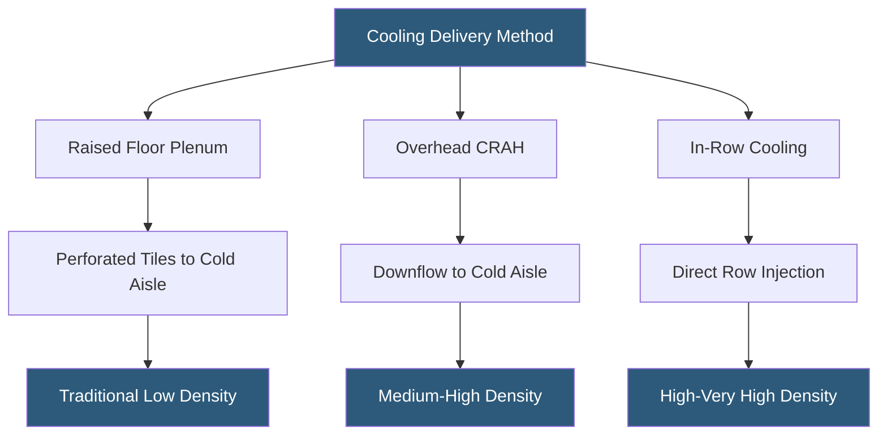

**Category:** Gigawatt Building & Structural
**Difficulty:** Intermediate
**Reading time:** 6 min read

---

The choice between raised access floor and slab-on-grade is a defining architectural decision for data hall design, directly impacting cable management, cooling delivery, equipment installation flexibility, and construction cost. At gigawatt scale, the industry has broadly shifted toward slab-on-grade with overhead distribution, though raised floors remain relevant for specific cooling and cabling scenarios.

- **Raised Access Floor (RAF)** — modular floor system on adjustable pedestals creating a pressurized plenum below the tiles
- **Plenum** — underfloor cavity used for cold air distribution in traditional CRAC-based cooling designs
- **Perforated Tile** — floor panel with open holes delivering cold air from plenum to cold aisle
- **Under-Floor Cable Routing** — power and data cabling run beneath raised floor panels for access and management
- **Overhead Bus Duct** — overhead power distribution via plug-in busway replacing traditional raised-floor PDU wiring
- **Hot-Aisle Containment** — physical barrier at top of hot aisle directing exhaust air to CRAH return path
- **Slab Flatness (F-number)** — measure of slab surface flatness critical for rolling equipment and rack leveling
- **Pedestal Height** — raised floor elevation above structural slab, typically 12–24 inches

Raised access floors were the dominant design for 30 years because they solved two problems simultaneously: cooling delivery and cable management. Cold air supplied by CRAC units pressurizes the plenum, and perforated tiles direct airflow into cold aisles at approximately 60–100 CFM per square foot. Power and data cables run in the plenum, accessible by lifting tiles anywhere on the floor plate. This flexibility was ideal for frequently changing mixed-workload environments.

The shift toward slab-on-grade has been driven by three converging forces: higher power densities, liquid cooling adoption, and overhead distribution maturity. At densities above 10–15 kW/rack, raised floors cannot deliver adequate airflow — the plenum becomes a bottleneck, and cable mass further restricts airflow. Overhead distribution solves both issues: power arrives via plug-in busway from above, data cables route through overhead trays, and cooling is delivered by in-row or overhead CRAH units or through liquid CDU manifolds at floor level.

Slab-on-grade designs achieve higher structural load capacity, lower construction cost (RAF systems add $8–15/sq ft), and better support for liquid cooling piping that penetrates the slab or runs in surface-mounted conduit. Maintenance is simplified because floor surface is fully accessible without tile management.

Raised floors retain advantages in retrofit scenarios and legacy mixed environments, where plenum airflow supplements in-row cooling for moderate-density zones. Hybrid designs are also common: slab in new high-density AI pods, raised floor in storage and network zones.

- Legacy 5 kW/rack colocation hall maintaining raised floor for existing customers
- New AI training cluster on SOG with direct liquid cooling supply at floor level
- Hybrid campus with RAF in network core and SOG in GPU compute pods
- Edge datacenter container where raised floor is impractical due to height constraints
- High-seismic zone where RAF pedestals create instability during ground motion

| Advantage | Disadvantage |
|-----------|--------------|
| Raised floor enables easy under-floor cable reconfiguration | RAF adds $8–15/sq ft to construction cost |
| SOG supports higher equipment loads without pedestal load limits | SOG requires overhead cable management infrastructure |
| SOG is compatible with any cooling approach including liquid | RAF plenum degrades at densities above 15 kW/rack |
| RAF provides aesthetic cable concealment in colocation environments | SOG requires precision flatness specification for rolling equipment |

- [Slab Design for Equipment Loads](slab-design-for-equipment-loads.md)
- [Hot Aisle Containment at Scale](../gigawatt-cooling-infrastructure/hot-aisle-containment-at-scale.md)
- [Floor Loading Capacity (lbs/sqft)](floor-loading-capacity-lbs-sqft.md)

---
*Part of the [Gigawatt Building & Structural](index.md) category · [Back to Master Index](../../index.md)*
